# VPC Essentials

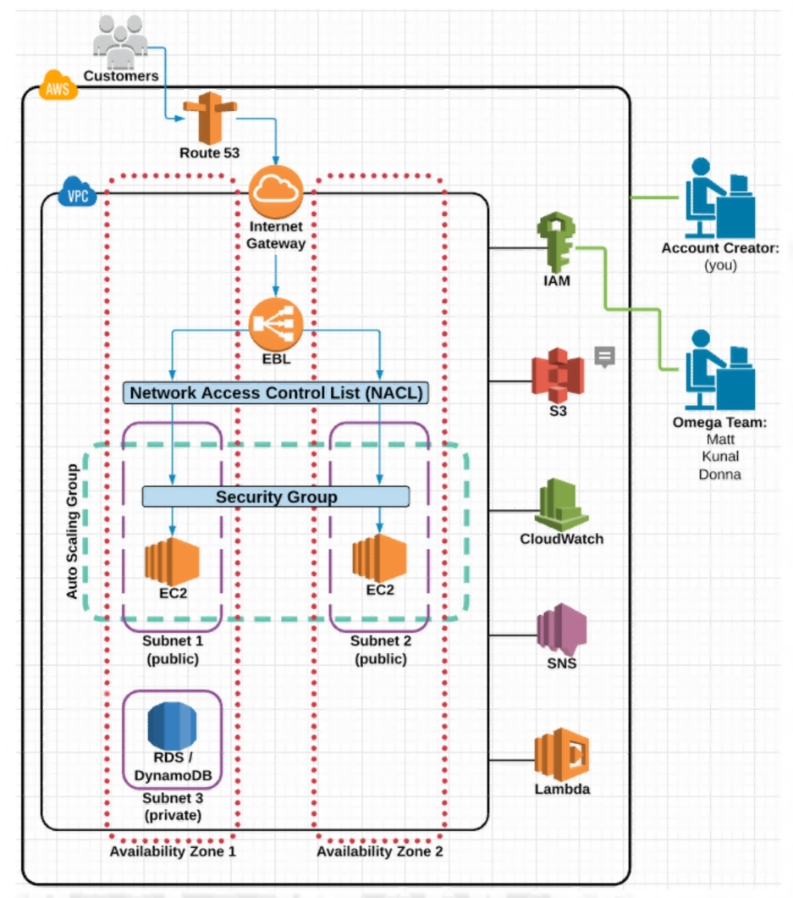

## Table of Contents
<!-- START doctoc generated TOC please keep comment here to allow auto update -->
<!-- DON'T EDIT THIS SECTION, INSTEAD RE-RUN doctoc TO UPDATE -->

- [AWS Global Infrastructure](#aws-global-infrastructure)
- [Virtual Private Cloud (VPC)](#virtual-private-cloud-vpc)
- [Internet Gateways (IGWs)](#internet-gateways-igws)
  - [State `attached`](#state-attached)
  - [State `detached`](#state-detached)
- [Route Tables (RTs)](#route-tables-rts)
  - [Status `blackhole`](#status-blackhole)
- [Network Access Control Lists (NACLs)](#network-access-control-lists-nacls)
- [Subnets](#subnets)
- [Availability Zones (VPC Specific)](#availability-zones-vpc-specific)
- [References](#references)

<!-- END doctoc generated TOC please keep comment here to allow auto update -->

## AWS Global Infrastructure

- **Regions** are comprised of multiple **Availability Zones**.
- **Availability Zones** (AZs) are where separate, physical **AWS Data Centers** are located.

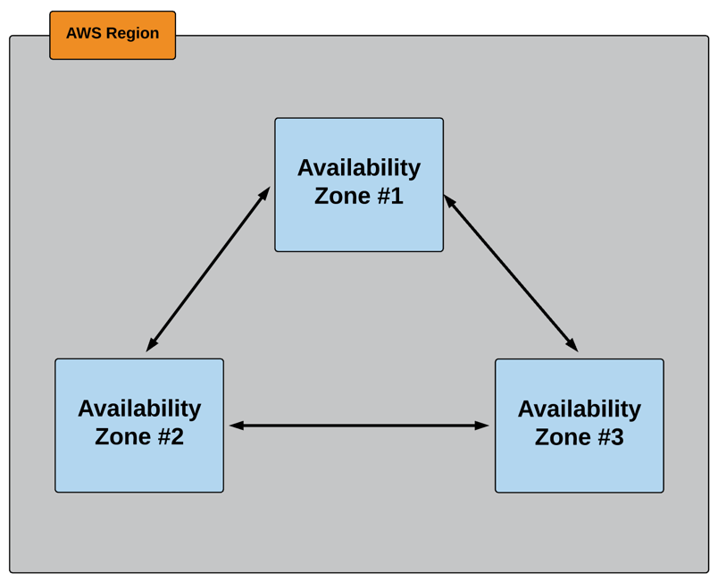

## Virtual Private Cloud (VPC)

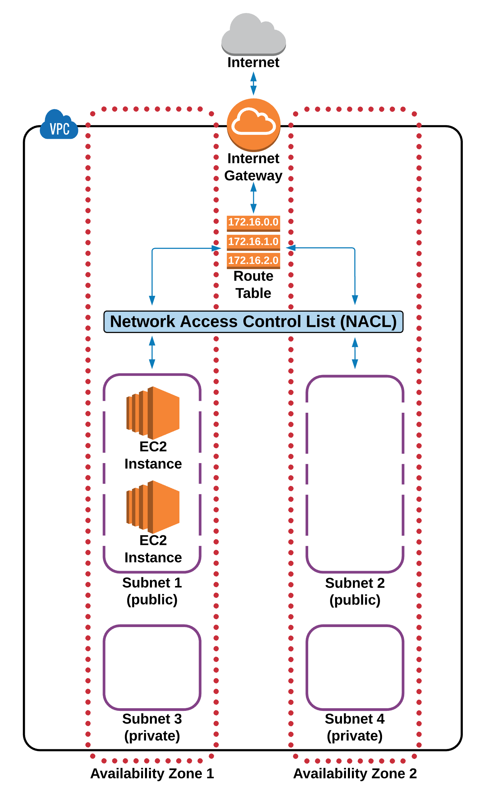

 

When creating an AWS account, a **Default VPC** is created for us, including the standard components that are needed make it functional:

1. An **Internet Gateway** attached.
1. A **Main Route Table** with predefined routes to the default subnets.
1. A **Default Network Access Control List** with predefined rules for controlling access to the default subnets.
1. **Subnets** to provision AWS resources in (such as **EC2 Instances**).

 

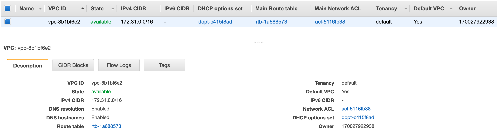

 

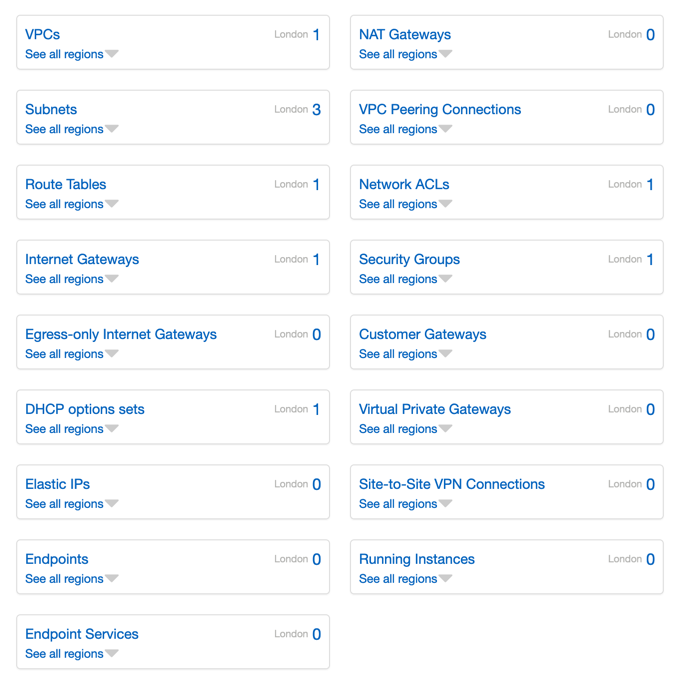

## Internet Gateways (IGWs)

- Only **one** IGW can be `attached` to a VPC at a time.
- An IGW cannot be `detached` from a VPC while there are active AWS resources in the VPC (such as an EC2 Instance or an RDS Database).

### State `attached`

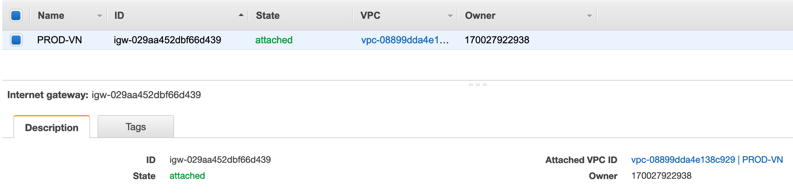

### State `detached`

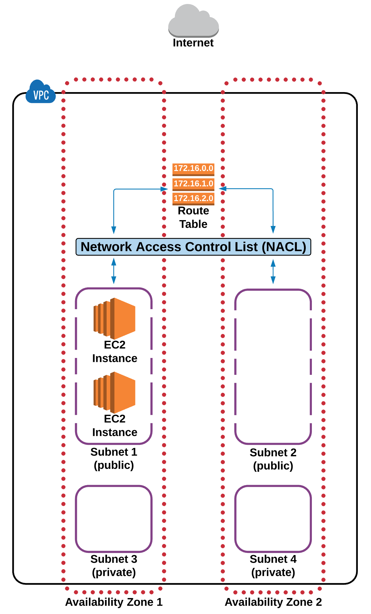

## Route Tables (RTs)

- A RT contains a **set of rules**, called **routes**, that are used to **determine where network traffic is directed**. 

 

  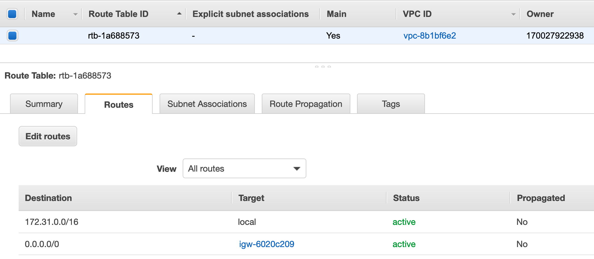
   
  <em>Main Route Table</em>

 

- Unlike an IGW, you can have multiple active RTs in a VPC.
- You can associate multiple subnets in an RT, but one subnet cannot be associated with multiple RTs.
- Subnets that are not explicitly associated with any RTs will be implicitly associated with the **Main RT**.
- You cannot delete an RT if it has dependencies (associated subnets).

 

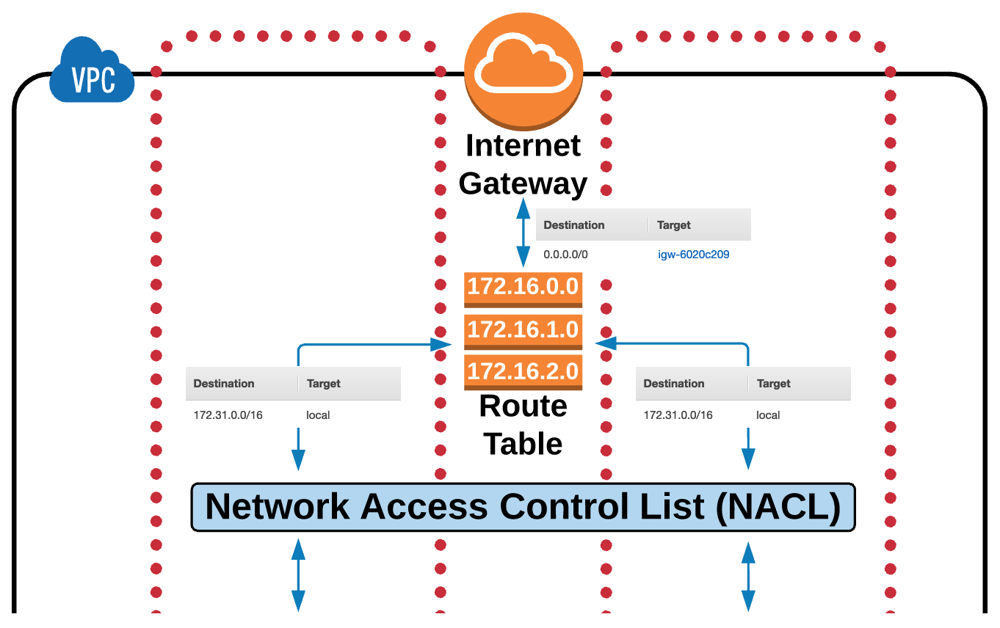

### Status `blackhole`

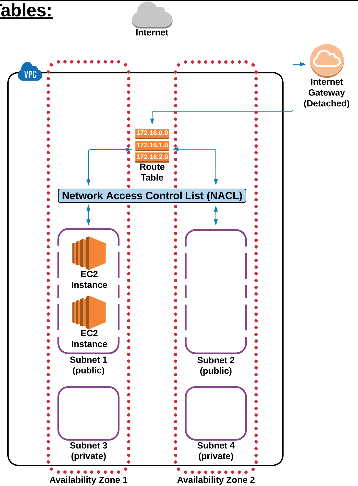

 

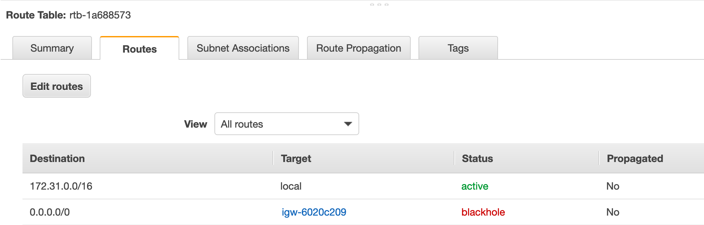

## Network Access Control Lists (NACLs)

- A NACL is an **optional layer of security** for your VPC that acts as a **Firewall** for controlling traffic in and out of one or more **subnets**.

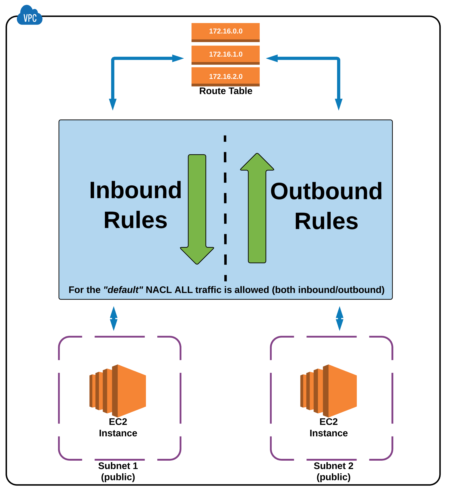

 

  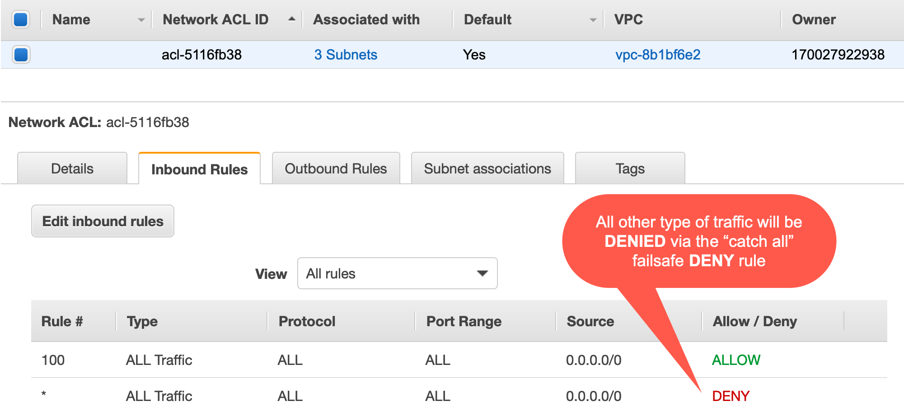
   
  <em>Default Network ACL</em>

 

- Rules are evaluated based on **`Rule #`** from lowest to highest.
- The first rule evaluated that applies to the traffic type gets immediately applied and executed, regardless of any rules that come after (have a higher **`Rule #`**).
- Any new NACLs you create DENY all traffic by default.
- A subnet can only be associated with one NACL at a time.
- An NACL allows or denies traffic from entering a subnet. Once inside the subnet, other AWS resources (e.g. **EC2 Instances**) may have an additional layer of security (**Security Groups**).

## Subnets

## Availability Zones (VPC Specific)

## References

- [AWS Essentials](https://www.youtube.com/playlist?list=PLv2a_5pNAko0Mijc6mnv04xeOut443Wnk)
- [Project Omega](https://www.lucidchart.com/documents/view/703f6119-4838-4bbb-bc7e-be2fb75e89e5/XT05XlW_ahiW)
- [VPC Dashboard - EU (London) Region](https://eu-west-2.console.aws.amazon.com/vpc/home?region=eu-west-2)
