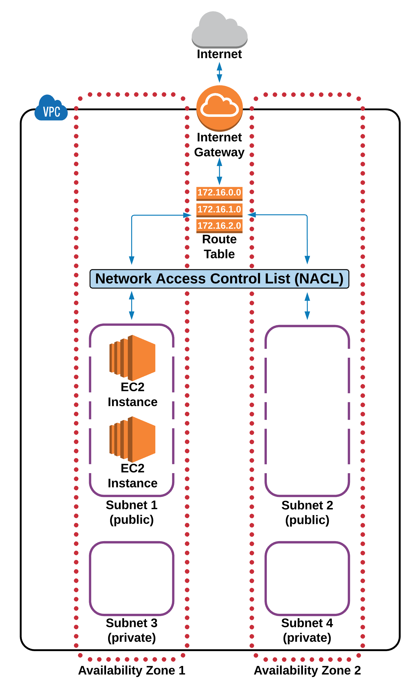

# VPC Essentials

## Table of Contents
<!-- START doctoc generated TOC please keep comment here to allow auto update -->
<!-- DON'T EDIT THIS SECTION, INSTEAD RE-RUN doctoc TO UPDATE -->

- [AWS Global Infrastructure](#aws-global-infrastructure)
- [Virtual Private Cloud (VPC)](#virtual-private-cloud-vpc)
- [Internet Gateways (IGWs)](#internet-gateways-igws)
- [Route Tables (RTs)](#route-tables-rts)
- [Network Access Control Lists (NACLs)](#network-access-control-lists-nacls)
- [Subnets](#subnets)
- [Availability Zones (VPC Specific)](#availability-zones-vpc-specific)
- [References](#references)

<!-- END doctoc generated TOC please keep comment here to allow auto update -->

## AWS Global Infrastructure

- **Regions** are comprised of multiple **Availability Zones**.
- **Availability Zones** (AZs) are where separate, physical **AWS Data Centers** are located.

## Virtual Private Cloud (VPC)

 

When creating an AWS account, a **Default VPC** is created for us, including the standard components that are needed make it functional:

1. An **Internet Gateway**.
1. A **Route Table** with predefined routes to the default subnets.
1. A **Network Access Control List** with predefined rules for access.
1. **Subnets** to provision AWS resources in (such as **EC2 Instances**).

## Internet Gateways (IGWs)

## Route Tables (RTs)

## Network Access Control Lists (NACLs)

## Subnets

## Availability Zones (VPC Specific)

## References

- [AWS Essentials](https://www.youtube.com/playlist?list=PLv2a_5pNAko0Mijc6mnv04xeOut443Wnk)
- [Project Omega](https://www.lucidchart.com/documents/view/703f6119-4838-4bbb-bc7e-be2fb75e89e5/XT05XlW_ahiW)
