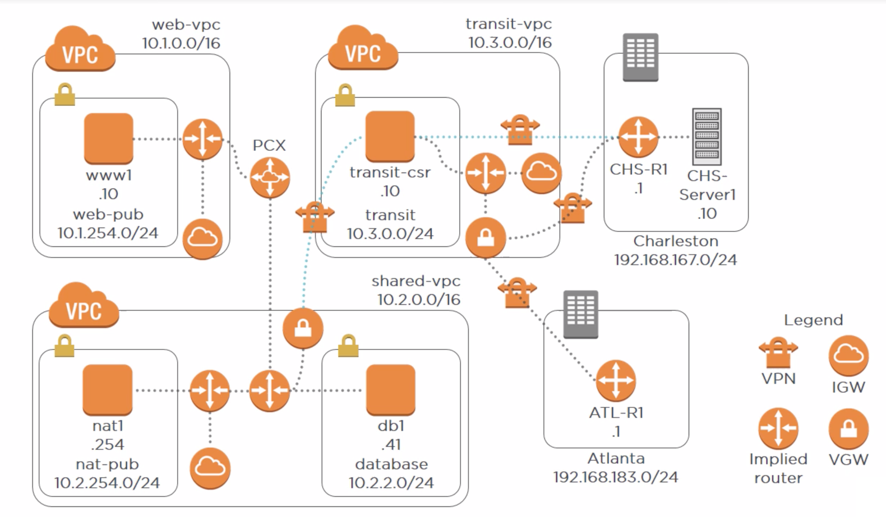

# Virtual Private Cloud (VPC)

## Table of Contents
<!-- START doctoc generated TOC please keep comment here to allow auto update -->
<!-- DON'T EDIT THIS SECTION, INSTEAD RE-RUN doctoc TO UPDATE -->

- [Creating Secure Virtual Private Clouds (VPCs)](#creating-secure-virtual-private-clouds-vpcs)
- [Creating Secure and Scalable VPCs](#creating-secure-and-scalable-vpcs)
- [VPC Peering](#vpc-peering)
- [Secure Internet Egress Using NAT Instances](#secure-internet-egress-using-nat-instances)
- [Using a Transit VPC to Connect On-premises and Cloud Resources](#using-a-transit-vpc-to-connect-on-premises-and-cloud-resources)
- [Using CloudHub to Connect Remote Sites Together](#using-cloudhub-to-connect-remote-sites-together)
- [Configuring IPv6 Connectivity](#configuring-ipv6-connectivity)

<!-- END doctoc generated TOC please keep comment here to allow auto update -->

## Creating Secure Virtual Private Clouds (VPCs)

## Creating Secure and Scalable VPCs

## VPC Peering

## Secure Internet Egress Using NAT Instances

## Using a Transit VPC to Connect On-premises and Cloud Resources

## Using CloudHub to Connect Remote Sites Together

## Configuring IPv6 Connectivity
