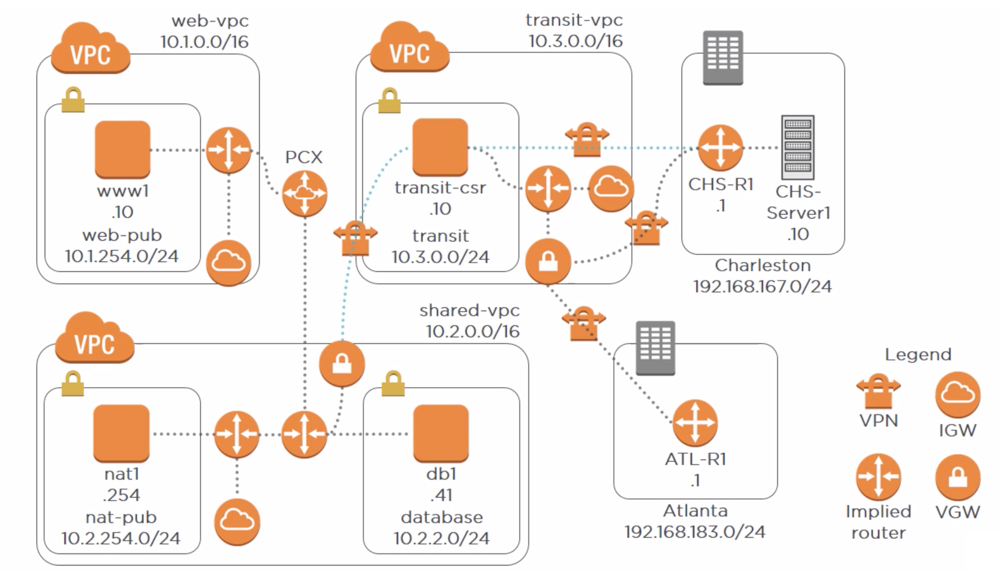

# Creating Virtual Private Clouds (VPCs)

- Web front-end (**www1**) must be internet-accessible via IPv4 and IPv6.
- Database instance (**db1**) must reside in a different subnet and not be open to the internet.
- Database instance should have outbound-only access to the IPv4 and IPv6 internet.
- **Charleston** office must have VPN access to the database instance.
- **Atlanta** and **Charleston** offices must be connected via a VPN.

## Table of Contents

<!-- START doctoc generated TOC please keep comment here to allow auto update -->
<!-- DON'T EDIT THIS SECTION, INSTEAD RE-RUN doctoc TO UPDATE -->

- [Creating Secure and Scalable VPCs](#creating-secure-and-scalable-vpcs)
- [VPC Peering](#vpc-peering)
- [Secure Internet Egress Using NAT Instances](#secure-internet-egress-using-nat-instances)
- [Using a Transit VPC to Connect On-premises and Cloud Resources](#using-a-transit-vpc-to-connect-on-premises-and-cloud-resources)
- [Using CloudHub to Connect Remote Sites Together](#using-cloudhub-to-connect-remote-sites-together)
- [Configuring IPv6 Connectivity](#configuring-ipv6-connectivity)
- [References](#references)

<!-- END doctoc generated TOC please keep comment here to allow auto update -->

## Creating Secure and Scalable VPCs

## VPC Peering

## Secure Internet Egress Using NAT Instances

## Using a Transit VPC to Connect On-premises and Cloud Resources

## Using CloudHub to Connect Remote Sites Together

## Configuring IPv6 Connectivity

## References

- [AWS Networking Deep Dive: Virtual Private Cloud (VPC)](https://app.pluralsight.com/library/courses/aws-networking-deep-dive-vpc/table-of-contents)
