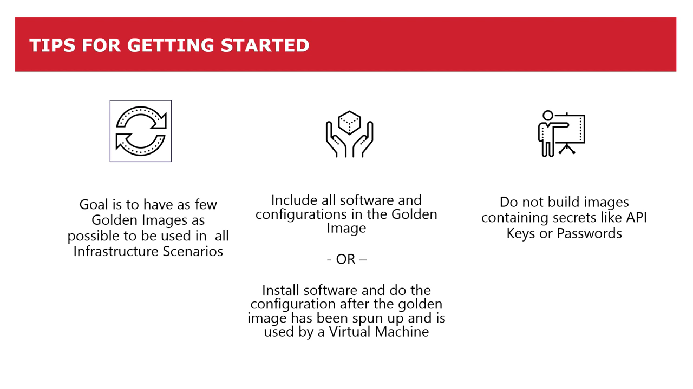

# Using Packer for building Custom AMI's

<div align="center"></div>

## Table of Contents

<!-- START doctoc generated TOC please keep comment here to allow auto update -->
<!-- DON'T EDIT THIS SECTION, INSTEAD RE-RUN doctoc TO UPDATE -->

- [What is a Golden Image](#what-is-a-golden-image)
- [What is Packer](#what-is-packer)
- [Templates](#templates)
- [Builders](#builders)
- [Provisioners](#provisioners)
- [HCL Configuration Language](#hcl-configuration-language)
- [References](#references)

<!-- END doctoc generated TOC please keep comment here to allow auto update -->

## What is a Golden Image

A golden image provides the template which a virtual machine
(for example, AWS EC2 instances) is created from.
It may also be referred to as a base image or an image template.
Think of it as a snapshot copy of an operating system that can be launched as a new virtual machine.

Usually, a golden image will contain:

- A Windows or Linux operating system installation
- The latest security patches and updates
- Configuration specific to your environment
- Software specific to your environment
- Security hardening settings, if required by your environment
- Agents such as an Octopus Deploy Tentacle for deploying software,
  or a Datadog Agent for monitoring the virtual machine

The idea is that you set up an operating system to the desired state,
save it and then you can re-use it across your infrastructure.

In network virtualization,
a golden image is an archetypal version of a cloned disk
that can be used as a template for various kinds of virtual network hardware.
Some refer to the golden image as a master image
because multiple copies are used to provide a consistent process for using a disk image.

Using golden images as templates,
managers can create consistent environments
where the end user doesn't have to know a lot about the technology in order to use it effectively.
These kinds of systems are taking off in a big way as companies
and enterprises replace old physical networks with virtual structures.

It's a term that has made its way into the collective consciousness
of anyone involved in creating one perfect model and then producing many duplicates from that mold.
That's what a gold master, or golden image, is:
The virtual mold from which you cast your distributable models.

And in system administration,
you may encounter golden images of an organization's chosen operating system,
with the important settings baked in—the virtual private network (VPN) certificates
are already in place,
incoming email servers are already set in the email client, and so on.
Similarly, you might also hear this term in the world of virtual machines (VMs),
where a golden image of a carefully configured virtual drive
is the source from which all new virtual machines are cloned.

<div align="center"></div>

golden-image-pipeline.png

golden-image-value-stream-possibilities.png

## What is Packer

> HashiCorp Packer has become the standard open source tool for
> creating **golden images** from code.

Learn how to use HashiCorp Packer in an Azure pipeline to maintain immutable infrastructure.
Brad Stevens, a Cloud Technical Lead at CDW discusses golden images in this talk:
A battle-tested virtual machine template
that forms the foundation for all other VMs used in the infrastructure.
Sometimes they're called base images or image templates,
but the goal remains the same: immutable infrastructure.

HashiCorp Packer has become the standard open source tool for creating golden images from code.
In this session from Microsoft Ignite,
you will see how to create pipelines to host golden images in Azure,
and make them available through Azure's Shared Image Gallery.
Simply do the configuration work once, and use it across your entire infrastructure.
It will save you time, make you faster and reduce human error.

Packer is an open source tool for creating identical machine images
for multiple platforms from a single source configuration.
Packer is lightweight, runs on every major operating system, and is highly performant,
creating machine images for multiple platforms in parallel.
Packer does not replace configuration management like Chef or Puppet.
In fact, when building images,
Packer is able to use tools like Chef or Puppet to install software onto the image.

A machine image is a single static unit that contains a pre-configured operating system
and installed software which is used to quickly create new running machines.
Machine image formats change for each platform.
Some examples include AMIs for EC2, VMDK/VMX files for VMware, OVF exports for VirtualBox, etc.

## Templates

Templates are JSON files that configure the various components of Packer
in order to create one or more machine images.
Templates are portable, static, and readable and writable by both humans and computers.
This has the added benefit of being able to not only create and modify templates by hand,
but also write scripts to dynamically create or modify templates.

Templates are given to commands such as `packer build`,
which will take the template and actually run the builds within it,
producing any resulting machine images.

Templates are JSON files which define one or more builds
by configuring the various components of Packer.
Packer is able to read a template and use that information to create multiple machine images in parallel.

## Builders

> Builders are components of Packer that are able to create a machine image for a single platform.
> Builders read in some configuration and use that to run and generate a machine image.
> A builder is invoked as part of a build in order to create the actual resulting images.
> Example builders include VirtualBox, VMware, and Amazon EC2.
> Builders can be created and added to Packer in the form of plugins.

<!-- AUTO-GENERATED-CONTENT:START (CODE:src=labs/packer-builders.json) -->
<!-- The below code snippet is automatically added from labs/packer-builders.json -->

```json
{
  "variables": {
    "aws_region": "us-east-1"
  },
  "builders": [
    {
      "ami_name": "training-amazon-linux-{{isotime | clean_resource_name}}",
      "ami_description": "Linux-AMI",
      "instance_type": "t2.micro",
      "name": "amazon-linux-ami",
      "region": "{{user `aws_region`}}",
      "type": "amazon-ebs",
      "source_ami_filter": {
        "filters": {
          "virtualization-type": "hvm",
          "architecture": "x86_64",
          "name": "*amzn-ami-hvm-*",
          "block-device-mapping.volume-type": "gp2",
          "root-device-type": "ebs"
        },
        "owners": ["amazon"],
        "most_recent": true
      },
      "ssh_username": "ec2-user"
    }
  ]
}
```

<!-- AUTO-GENERATED-CONTENT:END -->

<!-- AUTO-GENERATED-CONTENT:START (CODE:src=labs/packer-builders.sh) -->
<!-- The below code snippet is automatically added from labs/packer-builders.sh -->

```sh
#!/usr/bin/env bash

set -eoux pipefail

packer validate packer-builders.json

packer build packer-builders.json
```

<!-- AUTO-GENERATED-CONTENT:END -->

## Provisioners

> Provisioners are components of Packer that install and configure software
> within a running machine prior to that machine being turned into a static image.
> They perform the major work of making the image contain useful software.
> Example provisioners include shell scripts, Chef, Puppet, etc.

<!-- AUTO-GENERATED-CONTENT:START (CODE:src=labs/packer-provisioners.json) -->
<!-- The below code snippet is automatically added from labs/packer-provisioners.json -->

```json
{
  "variables": {
    "aws_region": "us-east-1"
  },
  "builders": [
    {
      "ami_name": "training-amazon-linux-{{isotime | clean_resource_name}}",
      "ami_description": "Linux-AMI",
      "instance_type": "t2.micro",
      "name": "amazon-linux-ami",
      "region": "{{user `aws_region`}}",
      "type": "amazon-ebs",
      "source_ami_filter": {
        "filters": {
          "virtualization-type": "hvm",
          "architecture": "x86_64",
          "name": "*amzn-ami-hvm-*",
          "block-device-mapping.volume-type": "gp2",
          "root-device-type": "ebs"
        },
        "owners": ["amazon"],
        "most_recent": true
      },
      "ssh_username": "ec2-user"
    }
  ],
  "provisioners": [
    {
      "type": "shell",
      "inline": [
        "sudo mkdir -p /opt/packer",
        "sudo mkdir -p /opt/packer/nginx",
        "sudo chown -R ec2-user:ec2-user /opt"
      ]
    },
    {
      "type": "file",
      "source": "wordpress-nginx.sh",
      "destination": "/opt/packer/wordpress-nginx.sh"
    },
    {
      "type": "shell",
      "inline": ["/opt/packer/wordpress-nginx.sh"]
    }
  ]
}
```

<!-- AUTO-GENERATED-CONTENT:END -->

<!-- AUTO-GENERATED-CONTENT:START (CODE:src=labs/packer-provisioners.sh) -->
<!-- The below code snippet is automatically added from labs/packer-provisioners.sh -->

```sh
#!/usr/bin/env bash

set -eoux pipefail

packer validate packer-provisioners.json

packer build packer-provisioners.json
```

<!-- AUTO-GENERATED-CONTENT:END -->

## HCL Configuration Language

## References

- [Building a Golden Image Pipeline](https://www.youtube.com/watch?v=mtEeYp28FnE)
- [Packer Terminology](https://www.packer.io/docs/terminology)
- [Introduction to Packer HCL2](https://www.packer.io/guides/hcl)
