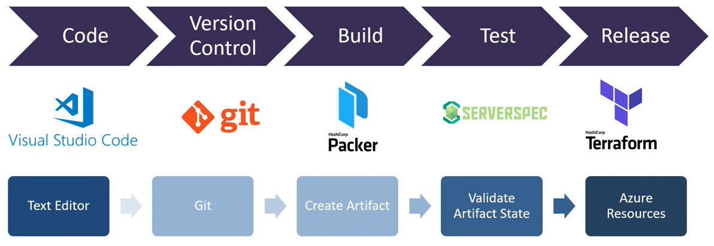
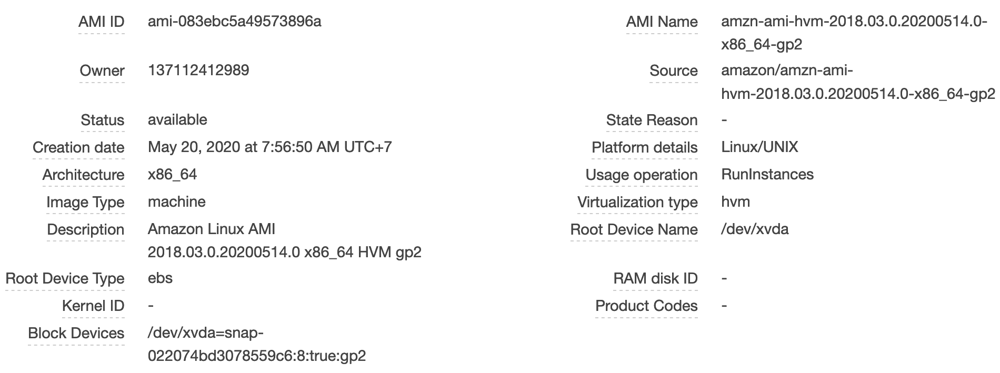
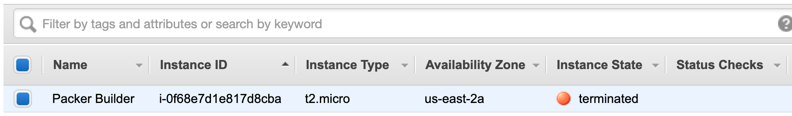

# Using Packer for building Custom AMIs

<div align="center">
  
  <br />
  <div>An example of using <b>Packer</b> in an automated workflow</div>
</div>

## Table of Contents

<!-- START doctoc generated TOC please keep comment here to allow auto update -->
<!-- DON'T EDIT THIS SECTION, INSTEAD RE-RUN doctoc TO UPDATE -->

- [What is a Golden Image](#what-is-a-golden-image)
  - [Tips for Getting Started](#tips-for-getting-started)
- [What is Packer](#what-is-packer)
- [Concepts](#concepts)
  - [Builders](#builders)
  - [Provisioners](#provisioners)
  - [Templates](#templates)
    - [Template Builders](#template-builders)
    - [Template Provisioners](#template-provisioners)
    - [Template Communicators](#template-communicators)
    - [Template Engine](#template-engine)
    - [Template Post-Processors](#template-post-processors)
    - [Template User Variables](#template-user-variables)
- [Practices](#practices)
  - [AMI Builder (EBS backed)](#ami-builder-ebs-backed)
  - [Common Provisioners](#common-provisioners)
- [HCL Configuration Language](#hcl-configuration-language)
- [Cleaning Up Amazon EBS-Backed AMI](#cleaning-up-amazon-ebs-backed-ami)
- [Pricing](#pricing)
- [References](#references)

<!-- END doctoc generated TOC please keep comment here to allow auto update -->

## What is a Golden Image

A golden image provides the template which a virtual machine
(e.g. AWS EC2 instances) is created from.
It may also be referred to as a base image or an image template.

The idea is that you set up an operating system to the desired state,
save it and then you can re-use it across your infrastructure.

You might hear this term in the world of virtual machines (VMs),
where a golden image of a carefully configured virtual drive
is the source from which all new virtual machines are cloned.

<div align="center">
  
  <br />
  <strong>Golden Image Pipeline</strong>
  <br />
</div>

<br />

<div align="center">
  
  <br />
  <strong>Golden Image Value Stream Possibilities</strong>
  <br />
</div>

### Tips for Getting Started

- Goal is to have as few Golden Images as possible to be used in all Infrastructure Scenarios.

- Include all software and configurations in the Golden Image, OR.
- Install software and do the configuration
  after the golden image has been spun up and is used by a Virtual Machine.

- Do not build images containing secrets like API Keys and Passwords.

## What is Packer

> HashiCorp Packer has become
> the standard open source tool for creating golden images from code.

Learn how to use HashiCorp Packer in an Azure pipeline to maintain immutable infrastructure.
A battle-tested virtual machine template
that forms the foundation for all other VMs used in the infrastructure.
Sometimes they are called base images or image templates,
but the goal remains the same: immutable infrastructure.

You will see how to create pipelines to host golden images in Azure,
and make them available through Azure's Shared Image Gallery.
Simply do the configuration work once, and use it across your entire infrastructure.
It will save you time, make you faster and reduce human error.

Packer is an open source tool for creating identical machine images
for multiple platforms from a single source configuration.
Packer is lightweight, runs on every major operating system, and is highly performant,
creating machine images for multiple platforms in parallel.
Packer does not replace configuration management like Chef or Puppet.
In fact, when building images,
Packer is able to use tools like Chef or Puppet to install software onto the image.

## Concepts

### Builders

Builders are components of Packer that are able to create a machine image for a single platform.
Builders read in some configuration and use that to run and generate a machine image.
A builder is invoked as part of a build in order to create the actual resulting images.
Example builders include VirtualBox, VMware, and Amazon EC2.
Builders can be created and added to Packer in the form of plugins.

Builders are responsible for creating machines and generating images from them for various platforms.
For example, there are separate builders for EC2, VMware, VirtualBox, etc.
Packer comes with many builders by default,
and can also be extended to add new builders.

To learn more about an individual builder, choose it from the sidebar.
Each builder has its own configuration options and parameters.

### Provisioners

Provisioners are components of Packer that install and configure software
within a running machine prior to that machine being turned into a static image.
They perform the major work of making the image contain useful software.
Example provisioners include shell scripts, Chef, Puppet, etc.

Provisioners use builtin and third-party software to install
and configure the machine image after booting.
Provisioners prepare the system for use,
so common use cases for provisioners include:

- installing packages
- patching the kernel
- creating users
- downloading application code

See Template Provisioners to learn more about working with provisioners.
For information on an individual provisioner, choose it from the sidebar.

### Templates

Templates are JSON files which define one or more builds
by configuring the various components of Packer.
Packer is able to read a template and use that information to create multiple machine images in parallel.

#### Template Builders

Within the template,
the builders section contains an array of all the builders
that Packer should use to generate machine images for the template.

Builders are responsible for creating machines and generating images from them for various platforms.
For example, there are separate builders for EC2, VMware, VirtualBox, etc.
Packer comes with many builders by default,
and can also be extended to add new builders.

#### Template Provisioners

Within the template,
the provisioners section contains an array of all the provisioners
that Packer should use to install and configure software within running machines prior
to turning them into machine images.

Provisioners are optional.
If no provisioners are defined within a template,
then no software other than the defaults will be installed within the resulting machine images.
This is not typical, however, since much of the value of Packer is
to produce multiple identical images of pre-configured software.

#### Template Communicators

Communicators are the mechanism Packer uses to
upload files, execute scripts, etc. with the machine being created.

#### Template Engine

All strings within templates are processed by a common Packer templating engine,
where variables and functions can be used to modify the value of a configuration parameter at runtime.

The syntax of templates uses the following conventions:

- Anything template related happens within double-braces: `{{ }}`.
- Functions are specified directly within the braces, such as `{{timestamp}}`.
- Template variables are prefixed with a period and capitalized, such as `{{.Variable}}`.

#### Template Post-Processors

The post-processor section within a template configures any post-processing
that will be done to images built by the builders.
Examples of post-processing would be compressing files, uploading artifacts, etc.

Post-processors are optional.
If no post-processors are defined within a template,
then no post-processing will be done to the image.
The resulting artifact of a build is just the image outputted by the builder.

#### Template User Variables

User variables allow your templates to be further configured
with variables from the command-line, environment variables, Vault, or files.
This lets you parameterize your templates so that
you can keep secret tokens, environment-specific data,
and other types of information out of your templates.
This maximizes the portability of the template.

Using user variables expects you to know how configuration templates work.
If you don't know how configuration templates work yet, please read that page first.

## Practices

### [AMI Builder (EBS backed)](https://www.packer.io/docs/builders/amazon-ebs)

Type: `amazon-ebs`

The amazon-ebs Packer builder is able to create Amazon AMIs backed by EBS volumes for use in EC2.
For more information on the difference between EBS-backed instances and instance-store backed instances,
see the "storage for the root device" section in the EC2 documentation.

This builder builds an AMI by launching an EC2 instance from a source AMI,
provisioning that running machine, and then creating an AMI from that machine.
This is all done in your own AWS account.
The builder will create temporary keypairs, security group rules, etc.
that provide it temporary access to the instance while the image is being created.
This simplifies configuration quite a bit.

The builder does not manage AMIs.
Once it creates an AMI and stores it in your account,
it is up to you to use, delete, etc. the AMI.

<!-- AUTO-GENERATED-CONTENT:START (CODE:src=labs/example-builders.json) -->
<!-- The below code snippet is automatically added from labs/example-builders.json -->

```json
{
  "variables": {
    "aws_region": "us-east-2"
  },
  "builders": [
    {
      "ami_name": "shopback-learning-packer-{{isotime | clean_resource_name}}",
      "ami_description": "ShopBack Linux AMI",
      "instance_type": "t2.micro",
      "name": "amazon-linux-ami",
      "region": "{{user `aws_region`}}",
      "type": "amazon-ebs",
      "source_ami_filter": {
        "filters": {
          "virtualization-type": "hvm",
          "architecture": "x86_64",
          "name": "*amzn-ami-hvm-*",
          "block-device-mapping.volume-type": "gp2",
          "root-device-type": "ebs"
        },
        "owners": ["amazon"],
        "most_recent": true
      },
      "ssh_username": "ec2-user"
    }
  ]
}
```

<!-- AUTO-GENERATED-CONTENT:END -->

<!-- AUTO-GENERATED-CONTENT:START (CODE:src=labs/example-builders.console) -->
<!-- The below code snippet is automatically added from labs/example-builders.console -->

```console
+ packer validate example-builders.json
Template validated successfully.
+ packer build -color=false example-builders.json
==> amazon-linux-ami: Prevalidating any provided VPC information
==> amazon-linux-ami: Prevalidating AMI Name: shopback-learning-packer-2020-05-24T09-12-39Z
    amazon-linux-ami: Found Image ID: ami-083ebc5a49573896a
==> amazon-linux-ami: Creating temporary keypair: packer_5eca3a87-e093-5d6b-7cf9-e1d7ab8a1b86
==> amazon-linux-ami: Creating temporary security group for this instance: packer_5eca3a8d-0d76-21c9-a819-da286e5e1530
==> amazon-linux-ami: Authorizing access to port 22 from [0.0.0.0/0] in the temporary security groups...
==> amazon-linux-ami: Launching a source AWS instance...
==> amazon-linux-ami: Adding tags to source instance
    amazon-linux-ami: Adding tag: "Name": "Packer Builder"
    amazon-linux-ami: Instance ID: i-0f68e7d1e817d8cba
==> amazon-linux-ami: Waiting for instance (i-0f68e7d1e817d8cba) to become ready...
==> amazon-linux-ami: Using ssh communicator to connect: 3.135.210.132
==> amazon-linux-ami: Waiting for SSH to become available...
==> amazon-linux-ami: Connected to SSH!
==> amazon-linux-ami: Stopping the source instance...
    amazon-linux-ami: Stopping instance
==> amazon-linux-ami: Waiting for the instance to stop...
==> amazon-linux-ami: Creating AMI shopback-learning-packer-2020-05-24T09-12-39Z from instance i-0f68e7d1e817d8cba
    amazon-linux-ami: AMI: ami-0f50843abd3b56267
==> amazon-linux-ami: Waiting for AMI to become ready...
==> amazon-linux-ami: Modifying attributes on AMI (ami-0f50843abd3b56267)...
    amazon-linux-ami: Modifying: description
==> amazon-linux-ami: Modifying attributes on snapshot (snap-04e1ecb3e3c5b995e)...
==> amazon-linux-ami: Terminating the source AWS instance...
==> amazon-linux-ami: Cleaning up any extra volumes...
==> amazon-linux-ami: No volumes to clean up, skipping
==> amazon-linux-ami: Deleting temporary security group...
==> amazon-linux-ami: Deleting temporary keypair...
Build 'amazon-linux-ami' finished.

==> Builds finished. The artifacts of successful builds are:
--> amazon-linux-ami: AMIs were created:
us-east-2: ami-0f50843abd3b56267
```

<!-- AUTO-GENERATED-CONTENT:END -->

<div align="center"></div>
<br />

<div align="center"></div>
<br />

<div align="center"></div>
<br />

<div align="center"></div>
<br />

<div align="center"></div>
<br />

<div align="center"></div>
<br />

### Common Provisioners

- **File Provisioner**

Type: `file`

The file Packer provisioner uploads files to machines built by Packer.
The recommended usage of the file provisioner is to use it to upload files,
and then use shell provisioner to move them to the proper place, set permissions, etc.

Warning: You can only upload files to locations
that the provisioning user (generally not root) has permission to access.
Creating files in /tmp and using a shell provisioner to move them into the final location
is the only way to upload files to root owned locations.

The file provisioner can upload both single files and complete directories.

- **Shell Provisioner**

Type: `shell`

The shell Packer provisioner provisions machines built by Packer using shell scripts.
Shell provisioning is the easiest way to get software installed and configured on a machine.

<!-- AUTO-GENERATED-CONTENT:START (CODE:src=labs/example-provisioners.json) -->
<!-- The below code snippet is automatically added from labs/example-provisioners.json -->

```json
{
  "variables": {
    "aws_region": "us-east-2"
  },
  "builders": [
    {
      "ami_name": "shopback-learning-packer-{{isotime | clean_resource_name}}",
      "ami_description": "ShopBack Linux AMI",
      "instance_type": "t2.micro",
      "name": "amazon-linux-ami",
      "region": "{{user `aws_region`}}",
      "type": "amazon-ebs",
      "source_ami_filter": {
        "filters": {
          "virtualization-type": "hvm",
          "architecture": "x86_64",
          "name": "*amzn-ami-hvm-*",
          "block-device-mapping.volume-type": "gp2",
          "root-device-type": "ebs"
        },
        "owners": ["amazon"],
        "most_recent": true
      },
      "ssh_username": "ec2-user"
    }
  ],
  "provisioners": [
    {
      "type": "shell",
      "inline": [
        "sudo mkdir -p /opt/packer/wordpress-nginx",
        "sudo chown -R ec2-user:ec2-user /opt"
      ]
    },
    {
      "type": "file",
      "source": "clone-source-code.sh",
      "destination": "/opt/packer/clone-source-code.sh"
    },
    {
      "type": "shell",
      "inline": ["/opt/packer/clone-source-code.sh"]
    }
  ]
}
```

<!-- AUTO-GENERATED-CONTENT:END -->

<!-- AUTO-GENERATED-CONTENT:START (CODE:src=labs/example-provisioners.console) -->
<!-- The below code snippet is automatically added from labs/example-provisioners.console -->

```console
+ packer validate example-provisioners.json
Template validated successfully.
+ packer build -color=false example-provisioners.json
==> amazon-linux-ami: Prevalidating any provided VPC information
==> amazon-linux-ami: Prevalidating AMI Name: shopback-learning-packer-2020-05-23T04-41-57Z
    amazon-linux-ami: Found Image ID: ami-01d025118d8e760db
==> amazon-linux-ami: Creating temporary keypair: packer_5ec8a996-9295-e663-e3eb-3621e4f77c40
==> amazon-linux-ami: Creating temporary security group for this instance: packer_5ec8a99c-4998-37f1-3fbe-4f434e847cc1
==> amazon-linux-ami: Authorizing access to port 22 from [0.0.0.0/0] in the temporary security groups...
==> amazon-linux-ami: Launching a source AWS instance...
==> amazon-linux-ami: Adding tags to source instance
    amazon-linux-ami: Adding tag: "Name": "Packer Builder"
    amazon-linux-ami: Instance ID: i-0bf861f30a3fa426c
==> amazon-linux-ami: Waiting for instance (i-0bf861f30a3fa426c) to become ready...
==> amazon-linux-ami: Using ssh communicator to connect: 34.205.65.203
==> amazon-linux-ami: Waiting for SSH to become available...
==> amazon-linux-ami: Connected to SSH!
==> amazon-linux-ami: Provisioning with shell script: /var/folders/s9/lyjc62f13fq772dt_gjt2w100000gn/T/packer-shell373575102
==> amazon-linux-ami: Uploading clone-source-code.sh => /opt/packer/clone-source-code.sh

clone-source-code.sh 170 B / 170 B [================================================] 100.00%

clone-source-code.sh 170 B / 170 B [================================================] 100.00%

clone-source-code.sh 170 B / 170 B [================================================] 100.00%

clone-source-code.sh 170 B / 170 B [================================================] 100.00%

clone-source-code.sh 170 B / 170 B [================================================] 100.00%

clone-source-code.sh 170 B / 170 B [=============================================] 100.00% 1s
==> amazon-linux-ami: Provisioning with shell script: /var/folders/s9/lyjc62f13fq772dt_gjt2w100000gn/T/packer-shell254046462
==> amazon-linux-ami: + sudo yum --quiet --assumeyes install git
==> amazon-linux-ami: + git clone https://github.com/A5hleyRich/wordpress-nginx.git /opt/packer/wordpress-nginx
==> amazon-linux-ami: Cloning into '/opt/packer/wordpress-nginx'...
==> amazon-linux-ami: Stopping the source instance...
    amazon-linux-ami: Stopping instance
==> amazon-linux-ami: Waiting for the instance to stop...
==> amazon-linux-ami: Creating AMI shopback-learning-packer-2020-05-23T04-41-57Z from instance i-0bf861f30a3fa426c
    amazon-linux-ami: AMI: ami-0c0f8339a416eea03
==> amazon-linux-ami: Waiting for AMI to become ready...
==> amazon-linux-ami: Modifying attributes on AMI (ami-0c0f8339a416eea03)...
    amazon-linux-ami: Modifying: description
==> amazon-linux-ami: Modifying attributes on snapshot (snap-067ba06cc3e0aa8fd)...
==> amazon-linux-ami: Terminating the source AWS instance...
==> amazon-linux-ami: Cleaning up any extra volumes...
==> amazon-linux-ami: No volumes to clean up, skipping
==> amazon-linux-ami: Deleting temporary security group...
==> amazon-linux-ami: Deleting temporary keypair...
Build 'amazon-linux-ami' finished.

==> Builds finished. The artifacts of successful builds are:
--> amazon-linux-ami: AMIs were created:
us-east-2: ami-0c0f8339a416eea03
```

<!-- AUTO-GENERATED-CONTENT:END -->

## HCL Configuration Language

<!-- AUTO-GENERATED-CONTENT:START (CODE:src=labs/wordpress-nginx/variables.pkr.hcl) -->
<!-- The below code snippet is automatically added from labs/wordpress-nginx/variables.pkr.hcl -->

```hcl
# variables.pkr.hcl

variable "aws_region" {
  type    = string
  default = "us-east-2"
}
```

<!-- AUTO-GENERATED-CONTENT:END -->

<!-- AUTO-GENERATED-CONTENT:START (CODE:src=labs/wordpress-nginx/build.pkr.hcl) -->
<!-- The below code snippet is automatically added from labs/wordpress-nginx/build.pkr.hcl -->

```hcl
# build.pkr.hcl

# A build starts sources and runs provisioning steps on those sources.
build {
  sources = [
    # there can be multiple sources per build
    "source.amazon-ebs.example"
  ]

  # All provisioners and post-processors have a 1:1 correspondence to their
  # current layout. The argument name (ie: inline) must to be unquoted
  # and can be set using the equal sign operator (=).
  provisioner "shell" {
    inline = [
      "sudo mkdir -p /opt/packer/wordpress-nginx",
      "sudo chown -R ec2-user:ec2-user /opt"
    ]
  }

  provisioner "file" {
    source      = "clone-source-code.sh"
    destination = "/opt/packer/clone-source-code.sh"
  }

  provisioner "shell" {
    inline = [
      "/opt/packer/clone-source-code.sh"
    ]
  }

  # post-processors work too, example: `post-processor "shell-local" {}`.
}
```

<!-- AUTO-GENERATED-CONTENT:END -->

<!-- AUTO-GENERATED-CONTENT:START (CODE:src=labs/wordpress-nginx/sources.pkr.hcl) -->
<!-- The below code snippet is automatically added from labs/wordpress-nginx/sources.pkr.hcl -->

```hcl
# sources.pkr.hcl

# the source block is what was defined in the builders section and represents a
# reusable way to start a machine. You build your images from that source. All
# sources have a 1:1 correspondance to what currently is a builder. The
# argument name (ie: ami_name) must be unquoted and can be set using the equal
# sign operator (=).
source "amazon-ebs" "example" {
  # name = "amazon-linux-ami"?

  ami_name        = "shopback-learning-packer-{{isotime | clean_resource_name}}"
  ami_description = "ShopBack Linux AMI"
  instance_type   = "t2.micro"
  region          = var.aws_region

  source_ami_filter {
    filters = {
      virtualization-type = "hvm"
      architecture        = "x86_64"
      name                = "*amzn-ami-hvm-*"
      root-device-type    = "ebs"

      # "block-device-mapping.volume-type" = "gp2"?

    }
    owners      = ["amazon"]
    most_recent = true
  }

  communicator = "ssh"
  ssh_username = "ec2-user"
}
```

<!-- AUTO-GENERATED-CONTENT:END -->

<!-- AUTO-GENERATED-CONTENT:START (CODE:src=labs/wordpress-nginx.console) -->
<!-- The below code snippet is automatically added from labs/wordpress-nginx.console -->

```console
+ packer build -color=false wordpress-nginx
==> amazon-ebs: Prevalidating any provided VPC information
==> amazon-ebs: Prevalidating AMI Name: shopback-learning-packer-2020-05-23T04-45-18Z
    amazon-ebs: Found Image ID: ami-01d025118d8e760db
==> amazon-ebs: Creating temporary keypair: packer_5ec8aa5e-1388-cd17-569b-20e9f12b1fc6
==> amazon-ebs: Creating temporary security group for this instance: packer_5ec8aa66-0c85-4f3d-1fe6-d7eee67739d8
==> amazon-ebs: Authorizing access to port 22 from [0.0.0.0/0] in the temporary security groups...
==> amazon-ebs: Launching a source AWS instance...
==> amazon-ebs: Adding tags to source instance
    amazon-ebs: Adding tag: "Name": "Packer Builder"
    amazon-ebs: Instance ID: i-0aefdff77cc6fe562
==> amazon-ebs: Waiting for instance (i-0aefdff77cc6fe562) to become ready...
==> amazon-ebs: Using ssh communicator to connect: 35.175.130.53
==> amazon-ebs: Waiting for SSH to become available...
==> amazon-ebs: Connected to SSH!
==> amazon-ebs: Provisioning with shell script: /var/folders/s9/lyjc62f13fq772dt_gjt2w100000gn/T/packer-shell060501310
==> amazon-ebs: Uploading clone-source-code.sh => /opt/packer/clone-source-code.sh

clone-source-code.sh 170 B / 170 B [================================================] 100.00%

clone-source-code.sh 170 B / 170 B [================================================] 100.00%

clone-source-code.sh 170 B / 170 B [================================================] 100.00%

clone-source-code.sh 170 B / 170 B [================================================] 100.00%

clone-source-code.sh 170 B / 170 B [================================================] 100.00%

clone-source-code.sh 170 B / 170 B [================================================] 100.00%

clone-source-code.sh 170 B / 170 B [=============================================] 100.00% 1s
==> amazon-ebs: Provisioning with shell script: /var/folders/s9/lyjc62f13fq772dt_gjt2w100000gn/T/packer-shell241211926
==> amazon-ebs: + sudo yum --quiet --assumeyes install git
==> amazon-ebs: + git clone https://github.com/A5hleyRich/wordpress-nginx.git /opt/packer/wordpress-nginx
==> amazon-ebs: Cloning into '/opt/packer/wordpress-nginx'...
==> amazon-ebs: Stopping the source instance...
    amazon-ebs: Stopping instance
==> amazon-ebs: Waiting for the instance to stop...
==> amazon-ebs: Creating AMI shopback-learning-packer-2020-05-23T04-45-18Z from instance i-0aefdff77cc6fe562
    amazon-ebs: AMI: ami-026d8f7eda024b8ed
==> amazon-ebs: Waiting for AMI to become ready...
==> amazon-ebs: Modifying attributes on AMI (ami-026d8f7eda024b8ed)...
    amazon-ebs: Modifying: description
==> amazon-ebs: Modifying attributes on snapshot (snap-0ff5c552b4f79e66b)...
==> amazon-ebs: Terminating the source AWS instance...
==> amazon-ebs: Cleaning up any extra volumes...
==> amazon-ebs: No volumes to clean up, skipping
==> amazon-ebs: Deleting temporary security group...
==> amazon-ebs: Deleting temporary keypair...
Build 'amazon-ebs' finished.

==> Builds finished. The artifacts of successful builds are:
--> amazon-ebs: AMIs were created:
us-east-2: ami-026d8f7eda024b8ed
```

<!-- AUTO-GENERATED-CONTENT:END -->

## Cleaning Up Amazon EBS-Backed AMI

<!-- AUTO-GENERATED-CONTENT:START (CODE:src=labs/cleanup.sh) -->
<!-- The below code snippet is automatically added from labs/cleanup.sh -->

```sh
#!/usr/bin/env bash

set -eou pipefail

export AWS_REGION="us-east-2"

readonly AMI_NAME="shopback-learning-packer-*"
readonly IMAGES=$(
  aws ec2 describe-images --output json \
    --filters "Name=name,Values=${AMI_NAME}"
)

main() {
  local -r index=$1
  local -r name=$(echo "$IMAGES" | jq --raw-output ".Images[${index}].Name")
  local -r image_id=$(echo "$IMAGES" | jq --raw-output ".Images[${index}].ImageId")
  local -r snapshot_id=$(echo "$IMAGES" | jq --raw-output ".Images[${index}].BlockDeviceMappings[0].Ebs.SnapshotId")

  printf "\n"
  echo "Found A Matching AMI       : ${name}"

  echo "- Deregistering This Image : ${image_id}"
  aws ec2 deregister-image --image-id "$image_id"

  echo "- Deleting This Snapshot   : ${snapshot_id}"
  aws ec2 delete-snapshot --snapshot-id "$snapshot_id"
}

for index in $(echo "$IMAGES" | jq '.Images | keys | .[]'); do
  main "$index"
done
```

<!-- AUTO-GENERATED-CONTENT:END -->

<!-- AUTO-GENERATED-CONTENT:START (CODE:src=labs/cleanup.console) -->
<!-- The below code snippet is automatically added from labs/cleanup.console -->

```console
Found A Matching AMI       : shopback-learning-packer-2020-05-23T04-45-18Z
- Deregistering This Image : ami-026d8f7eda024b8ed
- Deleting This Snapshot   : snap-0ff5c552b4f79e66b

Found A Matching AMI       : shopback-learning-packer-2020-05-23T04-38-41Z
- Deregistering This Image : ami-05ae982102ab92f0c
- Deleting This Snapshot   : snap-0141f0e5682cbb768

Found A Matching AMI       : shopback-learning-packer-2020-05-23T04-41-57Z
- Deregistering This Image : ami-0c0f8339a416eea03
- Deleting This Snapshot   : snap-067ba06cc3e0aa8fd
```

<!-- AUTO-GENERATED-CONTENT:END -->

When you deregister an Amazon EBS-backed AMI,
it doesn't affect the snapshot(s)
that were created for the volume(s) of the instance during the AMI creation process.
You will continue to incur storage costs for the snapshots.
Therefore, if you are finished with the snapshots, you should delete them.

<div align="center">
  
  <br />
  <div>The process for cleaning up your Amazon EBS-backed AMI</div>
</div>

## Pricing

Resources

- EC2
- AMI
- Snapshot

Singapore
t2.micro 1 Variable 1 GiB EBS Only \$0.0146 per Hour

You are only charged for the storage of the bits that make up your AMI,
there are no charges for creating an AMI.
EBS-backed AMIs are made up of snapshots of the EBS volumes that form the AMI.
You will pay storage fees for those snapshots according to the rates listed here.
<https://aws.amazon.com/ebs/pricing/>
Your EBS volumes are not "duplicated" until the instance is launched,
at which point a volume is created from the stored snapshots
and you will pay regular EBS volume fees and EBS snapshot billing.
<https://aws.amazon.com/ebs/pricing/>
<https://aws.amazon.com/premiumsupport/knowledge-center/ebs-snapshot-billing/>

S3-backed AMIs have their information stored in S3
and you will pay storage fees for the data being stored in S3 according to the S3 pricing,
<http://aws.amazon.com/s3/pricing/>
whether the instance is running or not.

Assuming this is an EBS AMI,
you will be charged for the snapshot(s) containing the data for your image.
The relevant pricing information can be found under "Amazon EBS Snapshots to Amazon S3"
at <http://aws.amazon.com/ec2/pricing/>.
"Subscriptions" (Reservations) are available for instances,
but not for the storage of your AMI.

Note that you will be charged separately for the EBS volumes used by your instances.
EBS is not the same as the instance storage included in the hourly fee.
See "Amazon EBS Standard volumes" right above the snapshot information.

Very close to nothing.

There is no cost to make an AMI itself,
but if you're making it from a running instance
you will pay the fees for running a micro instance
(which is about \$0.02/hr, depending on availability region - see the pricing details)
<http://aws.amazon.com/ec2/pricing/>
and also fees for using the EBS root for however long you use it.

When storing the AMI,
you only pay for the S3 storage taken from the snapshot.
The root FS must be an EBS volume (for all micro instances),
but this is stored as an EBS snapshot
(which are stored in S3, rather than EBS)
so you pay S3 fees to store it.
Note that EBS charges per allocated GB,
while S3 charges per used GB;
with the way they do things,
a 10G EBS volume that only has 500MB on it will only take up approx.
500MB of S3 storage.

Further to that,
Micro instances are included in Amazon's free tier at the moment,
so all of the above will cost you nothing
(with limits - see the pricing link above).

## References

- [Building a Golden Image Pipeline](https://www.youtube.com/watch?v=mtEeYp28FnE)
- [Packer Terminology](https://www.packer.io/docs/terminology)
- [Introduction to Packer HCL2](https://www.packer.io/guides/hcl)
