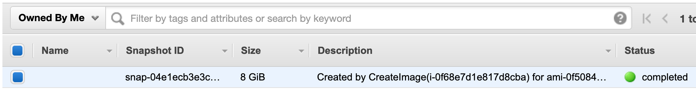

# Using Packer for building Custom AMIs

<div align="center">
  
  <br />
  <div>An example of using <b>Packer</b> in an automated workflow</div>
</div>

## Table of Contents

<!-- START doctoc generated TOC please keep comment here to allow auto update -->
<!-- DON'T EDIT THIS SECTION, INSTEAD RE-RUN doctoc TO UPDATE -->

- [What is a Golden Image](#what-is-a-golden-image)
  - [Tips for Getting Started](#tips-for-getting-started)
- [What is Packer](#what-is-packer)
- [Packer Concepts](#packer-concepts)
  - [Builders](#builders)
  - [Provisioners](#provisioners)
  - [Communicators](#communicators)
  - [Post-Processors](#post-processors)
  - [Templates](#templates)
    - [Template Engine](#template-engine)
    - [Template Variables](#template-variables)
    - [Template User Variables](#template-user-variables)
- [Instance Store vs. EBS](#instance-store-vs-ebs)
  - [AMI Types](#ami-types)
  - [Instance Store Volumes](#instance-store-volumes)
  - [`Instance Store-Backed` Instances](#instance-store-backed-instances)
  - [Elastic Block Store (EBS) Volumes](#elastic-block-store-ebs-volumes)
  - [`EBS-Backed` Instances](#ebs-backed-instances)
  - [Conclusion](#conclusion)
- [Packer Practices](#packer-practices)
  - [Commands (CLI)](#commands-cli)
  - [AMI Builder (EBS backed)](#ami-builder-ebs-backed)
  - [Common Provisioners](#common-provisioners)
    - [Shell Provisioner](#shell-provisioner)
    - [File Provisioner](#file-provisioner)
  - [HashiCorp Configuration Language (HCL)](#hashicorp-configuration-language-hcl)
- [Cleanup Amazon EBS-Backed AMI](#cleanup-amazon-ebs-backed-ami)
- [Debugging Packer Builds](#debugging-packer-builds)
- [AWS Pricing](#aws-pricing)
- [References](#references)

<!-- END doctoc generated TOC please keep comment here to allow auto update -->

## What is a Golden Image

A golden image provides the template which a virtual machine
(e.g. AWS EC2 instances) is created from.
It may also be referred to as a base image or an image template.

The idea is that you set up an operating system to the desired state,
save it and then you can re-use it across your infrastructure.

You might hear this term in the world of virtual machines (VMs),
where a golden image of a carefully configured virtual drive
is the source from which all new virtual machines are cloned.

<div align="center">
  
  <br />
  <strong>Golden Image Pipeline</strong>
  <br />
</div>

<br />

<div align="center">
  
  <br />
  <strong>Golden Image Value Stream Possibilities</strong>
  <br />
</div>

### Tips for Getting Started

- Goal is to have as few Golden Images as possible to be used in all Infrastructure Scenarios.

- Include all software and configurations in the Golden Image, OR.
- Install software and do the configuration
  after the golden image has been spun up and is used by a Virtual Machine.

- Do not build images containing secrets like API Keys and Passwords.

## What is Packer

> HashiCorp Packer has become
> the standard open source tool for creating golden images from code.

Learn how to use HashiCorp Packer in an Azure pipeline to maintain immutable infrastructure.
A battle-tested virtual machine template
that forms the foundation for all other VMs used in the infrastructure.
Sometimes they are called base images or image templates,
but the goal remains the same: immutable infrastructure.

You will see how to create pipelines to host golden images in Azure,
and make them available through Azure's Shared Image Gallery.
Simply do the configuration work once, and use it across your entire infrastructure.
It will save you time, make you faster and reduce human error.

Packer is an open source tool for creating identical machine images
for multiple platforms from a single source configuration.
Packer is lightweight, runs on every major operating system, and is highly performant,
creating machine images for multiple platforms in parallel.
Packer does not replace configuration management like Chef or Puppet.
In fact, when building images,
Packer is able to use tools like Chef or Puppet to install software onto the image.

## Packer Concepts

### [Builders](https://www.packer.io/docs/builders)

Builders are responsible for creating machines and generating images from them for various platforms.
For example, there are separate builders for EC2, VMware, VirtualBox, etc.
Packer comes with many builders by default, and can also be extended to add new builders.

### [Provisioners](https://www.packer.io/docs/provisioners)

Provisioners are components that install and configure software within a running machine
prior to that machine being turned into a static image.
They perform the major work of making the image contain useful software.
Example provisioners include shell scripts, Chef, Puppet, etc.

### [Communicators](https://www.packer.io/docs/communicators)

Communicators are the mechanism Packer uses to
upload files, execute scripts, etc. with the machine being created.

Communicators are configured within the builder section.
Packer currently supports three kinds of communicators:

- `none` - No communicator will be used.
  If this is set, most [provisioners](#provisioners) also can't be used.
- `ssh` - An SSH connection will be established to the machine. This is usually the default.
- `winrm` - A WinRM connection will be established.

In addition to the above, some builders have custom communicators they can use.
For example, the Docker builder has a "docker" communicator
that uses `docker exec` and `docker cp` to execute scripts and copy files.

### [Post-Processors](https://www.packer.io/docs/post-processors)

Post-processors run after the image is
built by the builder and provisioned by the provisioner(s).
They can be used to compress files, upload artifacts, re-package, or more.

### [Templates](https://www.packer.io/docs/templates)

> This is an old-style stable configuration language.
> From version `1.5.0` and later, Packer supports [HCL2 templates](https://www.packer.io/guides/hcl).

Templates are JSON files which define one or more builds
by configuring the various components of Packer.
Packer is able to read a template and use that information to create multiple machine images in parallel.

#### [Template Engine](https://www.packer.io/docs/templates/engine)

All strings within templates are processed by a common Packer templating engine,
where variables and functions can be used to modify the value of a configuration parameter at runtime.

The syntax of templates uses the following conventions:

- Anything template related happens within double-braces: `{{ }}`.
- **Functions** are specified directly within the braces, such as `{{timestamp}}`.
- **Template variables** are prefixed with a period and capitalized, such as `{{.Variable}}`.

#### Template Variables

Template variables are special variables automatically set by Packer at build time.
Some builders, provisioners and other components have template variables
that are available only for that component.
Template variables are recognizable because they're prefixed by a period, such as `{{ .Name }}`.
For example, when using the `shell builder` template variables are available
to customize the `execute_command` parameter used to determine how Packer will run the shell command.

```json
{
  "provisioners": [
    {
      "type": "shell",
      "execute_command": "{{.Vars}} sudo -E -S bash '{{.Path}}'",
      "scripts": ["scripts/bootstrap.sh"]
    }
  ]
}
```

The `{{ .Vars }}` and `{{ .Path }}` template variables will be replaced with
the list of the environment variables and, the path to the script to be executed respectively.

#### [Template User Variables](https://www.packer.io/docs/templates/user-variables)

User variables allow your templates to be further configured
with variables from the command-line, environment variables, Vault, or files.
This lets you parameterize your templates so that
you can keep secret tokens, environment-specific data,
and other types of information out of your templates.
This maximizes the portability of the template.

## Instance Store vs. EBS

- Some Amazon EC2 instance types come with a form of directly attached,
  block-device storage known as the instance store.
  The instance store is ideal for temporary storage,
  because the data stored in instance store volumes is not persistent through
  instance stops, terminations, or hardware failures.

- For data you want to retain longer,
  or if you want to encrypt the data,
  use Amazon EBS volumes instead.
  EBS volumes preserve their data through instance stops and terminations,
  can be easily backed up with EBS snapshots,
  can be removed from one instance and reattached to another,
  and support full-volume encryption.

### AMI Types

All AMIs are categorized as either backed by Amazon EBS or backed by instance store.
The former means that the root device for an instance launched from the AMI is
an Amazon EBS volume created from an Amazon EBS snapshot.
The latter means that the root device for an instance launched from the AMI is
an instance store volume created from a template stored in Amazon S3.

All AMIs are categorized as either backed by Amazon EBS,
which means that the root device for an instance launched from the AMI is an Amazon EBS volume,
or backed by instance store,
which means that the root device for an instance launched from the AMI
is an instance store volume created from a template stored in Amazon S3.

The description of an AMI indicates the type of root device
(either ebs or instance store).
This is important because there are significant differences
in what you can do with each type of AMI.
For more information about these differences, see Storage for the root device.

<br />

> When launching instances, you can choose from
> either **`Instance Store-Backed` AMIs** or an **`EBS-Backed` AMIs**.
> <br />
> We recommend that you use AMIs backed by Amazon EBS,
> because they launch faster and use persistent storage.

<br />

### Instance Store Volumes

Many instances can access storage from disks that are physically attached to the host computer.
This disk storage is referred to as instance store.
Instance store provides temporary block-level storage for instances.
The data on an instance store volume persists only during the life of the associated instance;
if you stop or terminate an instance, any data on instance store volumes is lost.
For more information, see Amazon EC2 Instance Store.

Let's start with what Instance storage is.
This is the disk that is physically attached to virtualization host.
This is the closest (lowest latency) storage available to your instance (other than RAM).
By Comparison EBS storage is storage on a remote network connected SAN
or NAS and may be competing for I/O with thousands of other instances.

For 90% of use cases the difference in latency will be irrelevant,
and certainly not worth the complication introduced
by the ephemeral nature of the `Instance Store` storage.
The performance difference in latency,
especially with SSD Instance Stores,
can have a profound impact on compute intensive workloads
where that CPU may be constantly waiting for data to be read from disk.

From time to time the ephemeral nature of Instance Stores is cited as a security advantage.
While may be true and of some value,
[IMO] this is a false sense of security
and should not be relied on if you are serious about your data security.
The wiping is done by a 'process' on the host.
If the Host fails suddenly those disks will not be wiped until the host is repaired,
or the disks are moved to another host, or destroyed.
Until that happens the data will be intact on the disks.
Therefore the security wiping is not 'guaranteed'
and the data on those disks cannot be assumed to be any more secure
that any other storage on that site.

### `Instance Store-Backed` Instances

> Instance store is a physically attached device which gives better performance
> but data will be lost once instance is rebooted.

Instances that use instance stores for the root device automatically have one
or more instance store volumes available,
with one volume serving as the root device volume.
When an instance is launched,
the image that is used to boot the instance is copied to the root volume.
Note that you can optionally use additional instance store volumes,
depending on the instance type.

Any data on the instance store volumes persists as long as the instance is running,
but this data is deleted when the instance is terminated
(instance store-backed instances do not support the Stop action)
or if it fails (such as if an underlying drive has issues).

<div align="center">
  
  <br />
  <div>Root device on an Amazon EC2 instance store-backed instance</div>
</div>

<br />

After an instance store-backed instance fails or terminates,
it cannot be restored.
If you plan to use Amazon EC2 instance store-backed instances,
we highly recommend that you distribute the data
on your instance stores across multiple Availability Zones.
You should also back up critical data from your instance store volumes
to persistent storage on a regular basis.

### Elastic Block Store (EBS) Volumes

Amazon EBS provides durable, block-level storage volumes that you can attach to a running instance.
You can use Amazon EBS as a primary storage device for data that requires frequent and granular updates.
For example, Amazon EBS is the recommended storage option when you run a database on an instance.

An EBS volume behaves like a raw, unformatted,
external block device that you can attach to a single instance.
The volume persists independently from the running life of an instance.
After an EBS volume is attached to an instance,
you can use it like any other physical hard drive.
As illustrated in the previous figure,
multiple volumes can be attached to an instance.
You can also detach an EBS volume from one instance
and attach it to another instance.
You can dynamically change the configuration of a volume attached to an instance.
EBS volumes can also be created as encrypted volumes using the Amazon EBS encryption feature.
For more information, see Amazon EBS encryption.

To keep a backup copy of your data,
you can create a snapshot of an EBS volume, which is stored in Amazon S3.
You can create an EBS volume from a snapshot, and attach it to another instance.
For more information, see Amazon Elastic Block Store.

Discussion about ephemeral storage vs. EBS is often phrased as two extremes,
with Instance Stores being at risk of disappearing at any moment vs. EBS
with is rock solid and will never fail.
While they are at either ends of the continuum, neither are extremes,
they are in some cases closer then often considered.

It is true that Instance Stores will be wiped if the instance is stopped.
However we have been happily using a technology
with similar characteristics since the beginning of electronic computing.
RAM is ephemeral storage and we use it without thinking about it.
We know it has this limitation and we compensate by
having processes that store important information on non-ephemeral media (tape, disk, EEPROM, etc)
so that we can recall it when needed.
Viewing Instance Stores in this way allows you think of it
in terms of a balance between the performance advantage
and the support solutions needed to allow you to take advantage of it.
Just as we do with RAM.

At the other end is the idea that EBS is so reliable that you don't need to worry about disk failure.
EBS volumes are not indestructible.
The presented volumes have a failure rate or ~0.2%.
This is about 20 times better than a std disk.
However if your app is super critical and you cannot risk an impact,
this effectively puts you in the same situation as with Instance stores.
You will need to engineer a fault tolerant solution.
The AWS design pattern is to always 'Design for Failure'
i.e. assume it will fail and design to pick up the load elsewhere.
For a high proportion of systems EBS is an adequate (and cost effective) solution.
However if your application is very sensitive the solution
to make EBS fault tolerant will be similar to making an Instance Store fault tolerant.

### `EBS-Backed` Instances

> EBS volume is network attached drive which results in slow performance
> but data is persistent meaning even if you reboot the instance data will be there.

Instances that use Amazon EBS for the root device automatically have an Amazon EBS volume attached.
When you launch an Amazon EBS-backed instance,
we create an Amazon EBS volume for each Amazon EBS snapshot referenced by the AMI you use.
You can optionally use other Amazon EBS volumes or instance store volumes,
depending on the instance type.

<div align="center">
  
  <br />
  <div>Root device volume and other Amazon EBS volumes of an Amazon EBS-backed instance</div>
</div>

<br />

An Amazon EBS-backed instance can be stopped
and later restarted without affecting data stored in the attached volumes.
There are various instance and volume-related tasks you can do
when an Amazon EBS-backed instance is in a stopped state.
For example, you can modify the properties of the instance,
change its size, or update the kernel it is using,
or you can attach your root volume to a different running instance for debugging or any other purpose.

### Conclusion

Instance stores still have value especially when it comes to massive IOPS at low latency.

Instance Stores may be ephemeral, but EBS storage is not 100% reliable either.
Decide the level of acceptable Risk and 'Design for Failure' accordingly,
regardless of the technology.

Until you get to the rarified atmosphere of high performance compute,
EBS storage provides plenty of grunt and a whole bunch of flexibility to meet most of your EC2 needs.

## Packer Practices

### [Commands (CLI)](https://www.packer.io/docs/commands)

```shell script
# Check that a template is valid
$ packer validate [options] TEMPLATE

# Fix templates from old versions of packer
$ packer fix [options] TEMPLATE

# Build image(s) from template
$ packer build [options] TEMPLATE
```

### [AMI Builder (EBS backed)](https://www.packer.io/docs/builders/amazon-ebs)

- Type: `amazon-ebs`

The amazon-ebs Packer builder is able to create Amazon AMIs backed by EBS volumes for use in EC2.
For more information on the difference between EBS-backed instances and instance-store backed instances,
see the "storage for the root device" section in the EC2 documentation.

<https://help.acloud.guru/hc/en-us/articles/115003534253-AWS-EC2-Instance-Store-vs-EBS>
<https://docs.aws.amazon.com/AWSEC2/latest/UserGuide/Storage.html>
<https://docs.aws.amazon.com/AWSEC2/latest/UserGuide/ComponentsAMIs.html#storage-for-the-root-device>

This builder builds an AMI by launching an EC2 instance from a source AMI,
provisioning that running machine, and then creating an AMI from that machine.
This is all done in your own AWS account.
The builder will create temporary keypairs, security group rules, etc.
that provide it temporary access to the instance while the image is being created.
This simplifies configuration quite a bit.

The builder does not manage AMIs.
Once it creates an AMI and stores it in your account,
it is up to you to use, delete, etc. the AMI.

<!-- AUTO-GENERATED-CONTENT:START (CODE:src=labs/example-builders.json) -->
<!-- The below code snippet is automatically added from labs/example-builders.json -->

```json
{
  "variables": {
    "aws_region": "us-east-2"
  },
  "builders": [
    {
      "ami_name": "shopback-learning-packer-{{isotime | clean_resource_name}}",
      "ami_description": "ShopBack Linux AMI",
      "instance_type": "t2.micro",
      "name": "amazon-linux-ami",
      "region": "{{user `aws_region`}}",
      "type": "amazon-ebs",
      "source_ami_filter": {
        "filters": {
          "virtualization-type": "hvm",
          "architecture": "x86_64",
          "name": "*amzn-ami-hvm-*",
          "block-device-mapping.volume-type": "gp2",
          "root-device-type": "ebs"
        },
        "owners": ["amazon"],
        "most_recent": true
      },
      "ssh_username": "ec2-user"
    }
  ]
}
```

<!-- AUTO-GENERATED-CONTENT:END -->

<br />

```console
$ packer validate example-builders.json
Template validated successfully.

$ packer build example-builders.json
==> amazon-linux-ami: Prevalidating any provided VPC information
==> amazon-linux-ami: Prevalidating AMI Name: shopback-learning-packer-2020-05-24T09-12-39Z
    amazon-linux-ami: Found Image ID: ami-083ebc5a49573896a
```

<div align="center"></div>

<br />

```console
==> amazon-linux-ami: Creating temporary keypair: packer_5eca3a87-e093-5d6b-7cf9-e1d7ab8a1b86
==> amazon-linux-ami: Creating temporary security group for this instance: packer_5eca3a8d-0d76-21c9-a819-da286e5e1530
==> amazon-linux-ami: Authorizing access to port 22 from [0.0.0.0/0] in the temporary security groups...
==> amazon-linux-ami: Launching a source AWS instance...
==> amazon-linux-ami: Adding tags to source instance
    amazon-linux-ami: Adding tag: "Name": "Packer Builder"
    amazon-linux-ami: Instance ID: i-0f68e7d1e817d8cba
==> amazon-linux-ami: Waiting for instance (i-0f68e7d1e817d8cba) to become ready...
==> amazon-linux-ami: Using ssh communicator to connect: 3.135.210.132
==> amazon-linux-ami: Waiting for SSH to become available...
==> amazon-linux-ami: Connected to SSH!
```

<div align="center"></div>
<div align="center"></div>

<br />

```console
==> amazon-linux-ami: Stopping the source instance...
    amazon-linux-ami: Stopping instance
==> amazon-linux-ami: Waiting for the instance to stop...
==> amazon-linux-ami: Creating AMI shopback-learning-packer-2020-05-24T09-12-39Z from instance i-0f68e7d1e817d8cba
    amazon-linux-ami: AMI: ami-0f50843abd3b56267
==> amazon-linux-ami: Waiting for AMI to become ready...
```

<div align="center"></div>

<br />

```console
==> amazon-linux-ami: Modifying attributes on AMI (ami-0f50843abd3b56267)...
    amazon-linux-ami: Modifying: description
==> amazon-linux-ami: Modifying attributes on snapshot (snap-04e1ecb3e3c5b995e)...
```

<div align="center"></div>

<br />

```console
==> amazon-linux-ami: Terminating the source AWS instance...
==> amazon-linux-ami: Cleaning up any extra volumes...
==> amazon-linux-ami: No volumes to clean up, skipping
==> amazon-linux-ami: Deleting temporary security group...
==> amazon-linux-ami: Deleting temporary keypair...
Build 'amazon-linux-ami' finished.
```

<div align="center"></div>
<div align="center"></div>

<br />

```console
==> Builds finished. The artifacts of successful builds are:
--> amazon-linux-ami: AMIs were created:
us-east-2: ami-0f50843abd3b56267
```

<div align="center"></div>

<br />

### Common Provisioners

#### [Shell Provisioner](https://www.packer.io/docs/provisioners/shell)

- Type: `shell`

The shell Packer provisioner provisions machines built by Packer using shell scripts.
Shell provisioning is the easiest way to get software installed and configured on a machine.

#### [File Provisioner](https://www.packer.io/docs/provisioners/file)

- Type: `file`

The file Packer provisioner uploads files to machines built by Packer.
The recommended usage of the file provisioner is to use it to upload files,
and then use shell provisioner to move them to the proper place, set permissions, etc.

Warning: You can only upload files to locations
that the provisioning user (generally not root) has permission to access.
Creating files in /tmp and using a shell provisioner to move them into the final location
is the only way to upload files to root owned locations.

The file provisioner can upload both single files and complete directories.

<br />

<!-- AUTO-GENERATED-CONTENT:START (CODE:src=labs/example-provisioners.json) -->
<!-- The below code snippet is automatically added from labs/example-provisioners.json -->

```json
{
  "variables": {
    "aws_region": "us-east-2"
  },
  "builders": [
    {
      "ami_name": "shopback-learning-packer-{{isotime | clean_resource_name}}",
      "ami_description": "ShopBack Linux AMI",
      "instance_type": "t2.micro",
      "name": "amazon-linux-ami",
      "region": "{{user `aws_region`}}",
      "type": "amazon-ebs",
      "source_ami_filter": {
        "filters": {
          "virtualization-type": "hvm",
          "architecture": "x86_64",
          "name": "*amzn-ami-hvm-*",
          "block-device-mapping.volume-type": "gp2",
          "root-device-type": "ebs"
        },
        "owners": ["amazon"],
        "most_recent": true
      },
      "ssh_username": "ec2-user"
    }
  ],
  "provisioners": [
    {
      "type": "shell",
      "inline": [
        "sudo mkdir -p /opt/packer/wordpress-nginx",
        "sudo chown -R ec2-user:ec2-user /opt"
      ]
    },
    {
      "type": "file",
      "source": "clone-source-code.sh",
      "destination": "/opt/packer/clone-source-code.sh"
    },
    {
      "type": "shell",
      "inline": ["/opt/packer/clone-source-code.sh"]
    }
  ]
}
```

<!-- AUTO-GENERATED-CONTENT:END -->

<!-- AUTO-GENERATED-CONTENT:START (CODE:src=labs/example-provisioners.console) -->
<!-- The below code snippet is automatically added from labs/example-provisioners.console -->

```console
+ packer validate example-provisioners.json
Template validated successfully.
+ packer build -color=false example-provisioners.json
==> amazon-linux-ami: Prevalidating any provided VPC information
==> amazon-linux-ami: Prevalidating AMI Name: shopback-learning-packer-2020-05-27T00-30-21Z
    amazon-linux-ami: Found Image ID: ami-083ebc5a49573896a
==> amazon-linux-ami: Creating temporary keypair: packer_5ecdb49d-5d6c-fd4a-3e5d-9ea885937a6d
==> amazon-linux-ami: Creating temporary security group for this instance: packer_5ecdb4a3-8c23-5e6f-084b-70f854a049fa
==> amazon-linux-ami: Authorizing access to port 22 from [0.0.0.0/0] in the temporary security groups...
==> amazon-linux-ami: Launching a source AWS instance...
==> amazon-linux-ami: Adding tags to source instance
    amazon-linux-ami: Adding tag: "Name": "Packer Builder"
    amazon-linux-ami: Instance ID: i-004e7cd4cd5891eb4
==> amazon-linux-ami: Waiting for instance (i-004e7cd4cd5891eb4) to become ready...
==> amazon-linux-ami: Using ssh communicator to connect: 3.14.127.197
==> amazon-linux-ami: Waiting for SSH to become available...
==> amazon-linux-ami: Connected to SSH!
==> amazon-linux-ami: Provisioning with shell script: /var/folders/s9/lyjc62f13fq772dt_gjt2w100000gn/T/packer-shell445888808
==> amazon-linux-ami: Uploading clone-source-code.sh => /opt/packer/clone-source-code.sh
clone-source-code.sh 170 B / 170 B [==================================] 100.00%
clone-source-code.sh 170 B / 170 B [==================================] 100.00%
clone-source-code.sh 170 B / 170 B [==================================] 100.00%
clone-source-code.sh 170 B / 170 B [==================================] 100.00%
clone-source-code.sh 170 B / 170 B [==================================] 100.00%
clone-source-code.sh 170 B / 170 B [==================================] 100.00%
clone-source-code.sh 170 B / 170 B [===============================] 100.00% 1s
==> amazon-linux-ami: Provisioning with shell script: /var/folders/s9/lyjc62f13fq772dt_gjt2w100000gn/T/packer-shell831335008
==> amazon-linux-ami: + sudo yum --quiet --assumeyes install git
==> amazon-linux-ami: + git clone https://github.com/A5hleyRich/wordpress-nginx.git /opt/packer/wordpress-nginx
==> amazon-linux-ami: Cloning into '/opt/packer/wordpress-nginx'...
==> amazon-linux-ami: Stopping the source instance...
    amazon-linux-ami: Stopping instance
==> amazon-linux-ami: Waiting for the instance to stop...
==> amazon-linux-ami: Creating AMI shopback-learning-packer-2020-05-27T00-30-21Z from instance i-004e7cd4cd5891eb4
    amazon-linux-ami: AMI: ami-03a1e765a272a7fd9
==> amazon-linux-ami: Waiting for AMI to become ready...
==> amazon-linux-ami: Modifying attributes on AMI (ami-03a1e765a272a7fd9)...
    amazon-linux-ami: Modifying: description
==> amazon-linux-ami: Modifying attributes on snapshot (snap-0cd034ff4c902b642)...
==> amazon-linux-ami: Terminating the source AWS instance...
==> amazon-linux-ami: Cleaning up any extra volumes...
==> amazon-linux-ami: No volumes to clean up, skipping
==> amazon-linux-ami: Deleting temporary security group...
==> amazon-linux-ami: Deleting temporary keypair...
Build 'amazon-linux-ami' finished.

==> Builds finished. The artifacts of successful builds are:
--> amazon-linux-ami: AMIs were created:
us-east-2: ami-03a1e765a272a7fd9
```

<!-- AUTO-GENERATED-CONTENT:END -->

### HashiCorp Configuration Language (HCL)

<!-- AUTO-GENERATED-CONTENT:START (CODE:src=labs/wordpress-nginx/variables.pkr.hcl) -->
<!-- The below code snippet is automatically added from labs/wordpress-nginx/variables.pkr.hcl -->

```hcl
# variables.pkr.hcl

variable "aws_region" {
  type    = string
  default = "us-east-2"
}
```

<!-- AUTO-GENERATED-CONTENT:END -->

<!-- AUTO-GENERATED-CONTENT:START (CODE:src=labs/wordpress-nginx/sources.pkr.hcl) -->
<!-- The below code snippet is automatically added from labs/wordpress-nginx/sources.pkr.hcl -->

```hcl
# sources.pkr.hcl

# the source block is what was defined in the builders section and represents a
# reusable way to start a machine. You build your images from that source. All
# sources have a 1:1 correspondance to what currently is a builder. The
# argument name (ie: ami_name) must be unquoted and can be set using the equal
# sign operator (=).
source "amazon-ebs" "example" {
  # name = "amazon-linux-ami"?

  ami_name        = "shopback-learning-packer-{{isotime | clean_resource_name}}"
  ami_description = "ShopBack Linux AMI"
  instance_type   = "t2.micro"
  region          = var.aws_region

  source_ami_filter {
    filters = {
      virtualization-type = "hvm"
      architecture        = "x86_64"
      name                = "*amzn-ami-hvm-*"
      root-device-type    = "ebs"

      # "block-device-mapping.volume-type" = "gp2"?

    }
    owners      = ["amazon"]
    most_recent = true
  }

  communicator = "ssh"
  ssh_username = "ec2-user"
}
```

<!-- AUTO-GENERATED-CONTENT:END -->

<!-- AUTO-GENERATED-CONTENT:START (CODE:src=labs/wordpress-nginx/build.pkr.hcl) -->
<!-- The below code snippet is automatically added from labs/wordpress-nginx/build.pkr.hcl -->

```hcl
# build.pkr.hcl

# A build starts sources and runs provisioning steps on those sources.
build {
  sources = [
    # there can be multiple sources per build
    "source.amazon-ebs.example"
  ]

  # All provisioners and post-processors have a 1:1 correspondence to their
  # current layout. The argument name (ie: inline) must to be unquoted
  # and can be set using the equal sign operator (=).
  provisioner "shell" {
    inline = [
      "sudo mkdir -p /opt/packer/wordpress-nginx",
      "sudo chown -R ec2-user:ec2-user /opt"
    ]
  }

  provisioner "file" {
    source      = "clone-source-code.sh"
    destination = "/opt/packer/clone-source-code.sh"
  }

  provisioner "shell" {
    inline = [
      "/opt/packer/clone-source-code.sh"
    ]
  }

  # post-processors work too, example: `post-processor "shell-local" {}`.
}
```

<!-- AUTO-GENERATED-CONTENT:END -->

<!-- AUTO-GENERATED-CONTENT:START (CODE:src=labs/wordpress-nginx.console) -->
<!-- The below code snippet is automatically added from labs/wordpress-nginx.console -->

```console
+ packer build -color=false wordpress-nginx
==> amazon-ebs: Prevalidating any provided VPC information
==> amazon-ebs: Prevalidating AMI Name: shopback-learning-packer-2020-05-27T00-33-47Z
    amazon-ebs: Found Image ID: ami-083ebc5a49573896a
==> amazon-ebs: Creating temporary keypair: packer_5ecdb56b-e6f2-a9b8-1868-b328c4c3ceb9
==> amazon-ebs: Creating temporary security group for this instance: packer_5ecdb571-72de-c293-5c09-fd91efd87bc4
==> amazon-ebs: Authorizing access to port 22 from [0.0.0.0/0] in the temporary security groups...
==> amazon-ebs: Launching a source AWS instance...
==> amazon-ebs: Adding tags to source instance
    amazon-ebs: Adding tag: "Name": "Packer Builder"
    amazon-ebs: Instance ID: i-017fd36501675dc46
==> amazon-ebs: Waiting for instance (i-017fd36501675dc46) to become ready...
==> amazon-ebs: Using ssh communicator to connect: 13.59.21.81
==> amazon-ebs: Waiting for SSH to become available...
==> amazon-ebs: Connected to SSH!
==> amazon-ebs: Provisioning with shell script: /var/folders/s9/lyjc62f13fq772dt_gjt2w100000gn/T/packer-shell785215325
==> amazon-ebs: Uploading clone-source-code.sh => /opt/packer/clone-source-code.sh
clone-source-code.sh 170 B / 170 B [==================================] 100.00%
clone-source-code.sh 170 B / 170 B [==================================] 100.00%
clone-source-code.sh 170 B / 170 B [==================================] 100.00%
clone-source-code.sh 170 B / 170 B [==================================] 100.00%
clone-source-code.sh 170 B / 170 B [==================================] 100.00%
clone-source-code.sh 170 B / 170 B [==================================] 100.00%
clone-source-code.sh 170 B / 170 B [===============================] 100.00% 1s
==> amazon-ebs: Provisioning with shell script: /var/folders/s9/lyjc62f13fq772dt_gjt2w100000gn/T/packer-shell311223221
==> amazon-ebs: + sudo yum --quiet --assumeyes install git
==> amazon-ebs: + git clone https://github.com/A5hleyRich/wordpress-nginx.git /opt/packer/wordpress-nginx
==> amazon-ebs: Cloning into '/opt/packer/wordpress-nginx'...
==> amazon-ebs: Stopping the source instance...
    amazon-ebs: Stopping instance
==> amazon-ebs: Waiting for the instance to stop...
==> amazon-ebs: Creating AMI shopback-learning-packer-2020-05-27T00-33-47Z from instance i-017fd36501675dc46
    amazon-ebs: AMI: ami-07cafedfc46ccf7f1
==> amazon-ebs: Waiting for AMI to become ready...
==> amazon-ebs: Modifying attributes on AMI (ami-07cafedfc46ccf7f1)...
    amazon-ebs: Modifying: description
==> amazon-ebs: Modifying attributes on snapshot (snap-0afa94e1202d25b14)...
==> amazon-ebs: Terminating the source AWS instance...
==> amazon-ebs: Cleaning up any extra volumes...
==> amazon-ebs: No volumes to clean up, skipping
==> amazon-ebs: Deleting temporary security group...
==> amazon-ebs: Deleting temporary keypair...
Build 'amazon-ebs' finished.

==> Builds finished. The artifacts of successful builds are:
--> amazon-ebs: AMIs were created:
us-east-2: ami-07cafedfc46ccf7f1
```

<!-- AUTO-GENERATED-CONTENT:END -->

## Cleanup Amazon EBS-Backed AMI

When you deregister an Amazon EBS-backed AMI,
it doesn't affect the snapshot(s)
that were created for the volume(s) of the instance during the AMI creation process.
You will continue to incur storage costs for the snapshots.
Therefore, if you are finished with the snapshots, you should delete them.

<div align="center">
  
  <br />
  <div>The process for cleaning up your Amazon EBS-backed AMI</div>
</div>

<br />

<!-- AUTO-GENERATED-CONTENT:START (CODE:src=labs/cleanup.sh) -->
<!-- The below code snippet is automatically added from labs/cleanup.sh -->

```sh
#!/usr/bin/env bash

set -eou pipefail

export AWS_REGION="us-east-2"

readonly AMI_NAME="shopback-learning-packer-*"
readonly IMAGES=$(aws ec2 describe-images --output json --filters "Name=name,Values=${AMI_NAME}")

main() {
  local -r index=$1
  local -r name=$(echo "$IMAGES" | jq --raw-output ".Images[${index}].Name")
  local -r image_id=$(echo "$IMAGES" | jq --raw-output ".Images[${index}].ImageId")
  local -r snapshot_id=$(echo "$IMAGES" | jq --raw-output ".Images[${index}].BlockDeviceMappings[0].Ebs.SnapshotId")

  printf "\n"
  echo "Found A Matching AMI       : ${name}"

  echo "- Deregistering This Image : ${image_id}"
  aws ec2 deregister-image --image-id "$image_id"

  echo "- Deleting This Snapshot   : ${snapshot_id}"
  aws ec2 delete-snapshot --snapshot-id "$snapshot_id"
}

for index in $(echo "$IMAGES" | jq '.Images | keys | .[]'); do
  main "$index"
done
```

<!-- AUTO-GENERATED-CONTENT:END -->

<!-- AUTO-GENERATED-CONTENT:START (CODE:src=labs/cleanup.console) -->
<!-- The below code snippet is automatically added from labs/cleanup.console -->

```console
Found A Matching AMI       : shopback-learning-packer-2020-05-27T00-30-21Z
- Deregistering This Image : ami-03a1e765a272a7fd9
- Deleting This Snapshot   : snap-0cd034ff4c902b642

Found A Matching AMI       : shopback-learning-packer-2020-05-27T00-33-47Z
- Deregistering This Image : ami-07cafedfc46ccf7f1
- Deleting This Snapshot   : snap-0afa94e1202d25b14

Found A Matching AMI       : shopback-learning-packer-2020-05-27T00-28-07Z
- Deregistering This Image : ami-08451804619926c69
- Deleting This Snapshot   : snap-0614c98b418c16616
```

<!-- AUTO-GENERATED-CONTENT:END -->

## Debugging Packer Builds

```shell script
packer build -on-error=ask
packer build -debug
```

## AWS Pricing

- Amazon EBS-backed AMI
  You're charged for instance usage,
  Amazon EBS volume usage, and storing your AMI as an Amazon EBS snapshot.
- Amazon instance store-backed AMI
  You're charged for instance usage and storing your AMI in Amazon S3.

<https://docs.aws.amazon.com/AWSEC2/latest/UserGuide/ComponentsAMIs.html#storage-for-the-root-device>

How you're charged

With AMIs backed by instance store,
you're charged for instance usage and storing your AMI in Amazon S3.
With AMIs backed by Amazon EBS,
you're charged for instance usage, Amazon EBS volume storage and usage,
and storing your AMI as an Amazon EBS snapshot.

With Amazon EC2 instance store-backed AMIs,
each time you customize an AMI and create a new one,
all of the parts are stored in Amazon S3 for each AMI.
So, the storage footprint for each customized AMI is the full size of the AMI.
For Amazon EBS-backed AMIs, each time you customize an AMI and create a new one,
only the changes are stored.
So the storage footprint for subsequent AMIs you customize after the first is much smaller,
resulting in lower AMI storage charges.

When an Amazon EBS-backed instance is stopped,
you're not charged for instance usage;
however, you're still charged for volume storage.
As soon as you start your instance, we charge a minimum of one minute for usage.
After one minute, we charge only for the seconds used.
For example, if you run an instance for 20 seconds and then stop it,
we charge for a full one minute.
If you run an instance for 3 minutes and 40 seconds,
we charge for exactly 3 minutes and 40 seconds of usage.
We charge you for each second, with a one-minute minimum,
that you keep the instance running,
even if the instance remains idle and you don't connect to it.

- [**EC2 Instance**](https://aws.amazon.com/ec2/pricing)

On-Demand instances

|          Region          | Operating System | Instance Type |        Cost        |
| :----------------------: | :--------------: | :-----------: | :----------------: |
| Asia Pacific (Singapore) |      Linux       |   t2.micro    | `$0.0146 per Hour` |

<br />

- **EBS Root**

Region: Asia Pacific (Singapore)

Amazon EBS Volumes

With Amazon EBS, you pay only for what you use.
The pricing for Amazon EBS volumes is listed below
General Purpose SSD (gp2) Volumes
`$0.12` per GB-month of provisioned storage

- **EBS-Backed AMI**

> An AMI that is based on EBS-backed EC2 instance.

By default, when creating an AMI from an instance,
snapshots are taken of each EBS volume attached to the instance.

Region: Asia Pacific (Singapore)

Amazon EBS Snapshots
EBS Snapshots
`$0.05` per GB-month of data stored

You are only charged for the storage of the bits that make up your AMI,
there are no charges for creating an AMI.
EBS-backed AMIs are made up of snapshots of the EBS volumes that form the AMI.
You will pay storage fees for those snapshots according to the rates listed here.
<https://aws.amazon.com/ebs/pricing>
you will be charged for the snapshot(s) containing the data for your image.

Note that you will be charged separately for the EBS volumes used by your instances.
EBS is not the same as the instance storage included in the hourly fee.
See "Amazon EBS Standard volumes" right above the snapshot information.
<https://docs.aws.amazon.com/AWSEC2/latest/UserGuide/Storage.html>

## References

- [Building a Golden Image Pipeline](https://www.youtube.com/watch?v=mtEeYp28FnE)
- [Amazon EC2 Root Device Volume](https://docs.aws.amazon.com/AWSEC2/latest/UserGuide/RootDeviceStorage.html)
- [Introduction to Packer HCL2](https://www.packer.io/guides/hcl)
