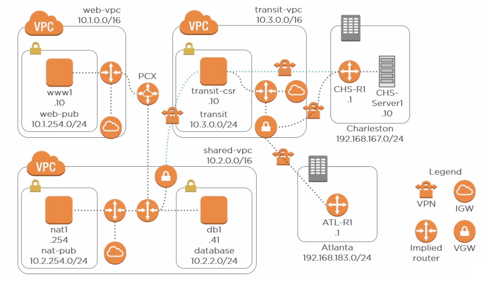

# Virtual Private Cloud (VPC)

- Web front-end (**www1**) must be internet-accessible via IPv4 and IPv6.
- Database instance (**db1**) must reside in a different subnet and not be open to the internet.
- Database instance should have outbound-only access to the IPv4 and IPv6 internet.
- **Charleston** office must have VPN access to the database instance.
- **Atlanta** and **Charleston** offices must be connected via a VPN.

## Table of Contents

<!-- START doctoc generated TOC please keep comment here to allow auto update -->
<!-- DON'T EDIT THIS SECTION, INSTEAD RE-RUN doctoc TO UPDATE -->

- [References](#references)

<!-- END doctoc generated TOC please keep comment here to allow auto update -->

## References
